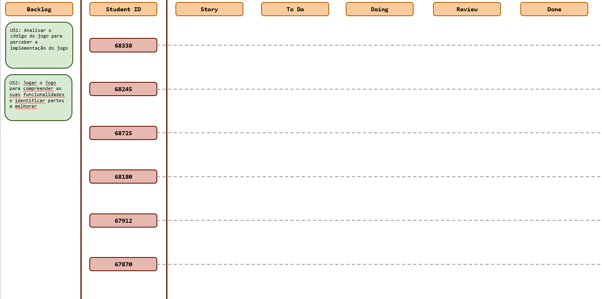
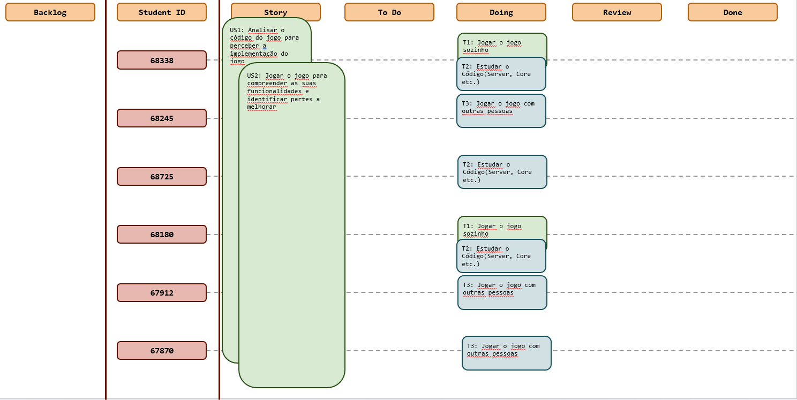
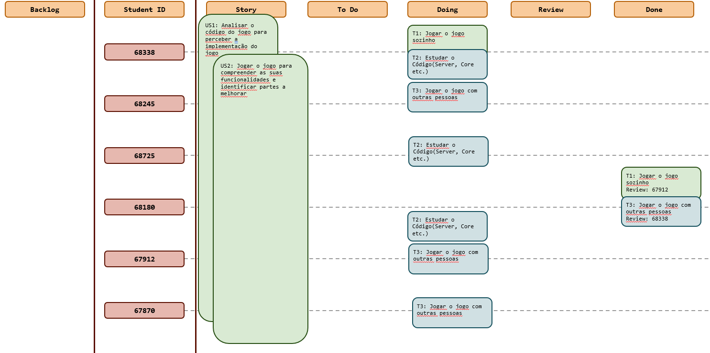

# Sprint 1

## Dates

2025-10-08 - 2025-10-19

## Scrum master

Miguel Cordeiro 68338

## Management info
### Sprint Planning Meeting: 
Nesta reunião decidimos estudar o código em profundidade e jogamos o jogo para entender melhor as suas funcionalidades.

### Sprint Review Meeting: 
Após a discussão concluimos que o estudo não foi suficiente e deve prosseguir para o próximo sprint.

### Sprint Retrospective Meeting: 
Concluímos que temos de melhorar a nossa abordagem à forma como vamos estudar o código no próximo sprint.
## Relevant resources

### Scrum Board at the beginning of the sprint

### Scrum Board in the middle of the sprint

### Scrum Board at the end of the sprint

### Burndown Chart for the sprint

[Burndown chart template (1).xlsx](Burndown%20chart%20template%20%281%29.xlsx)

### Gantt Chart

[Gantt Template.xlsx](Gantt%20Template.xlsx)

