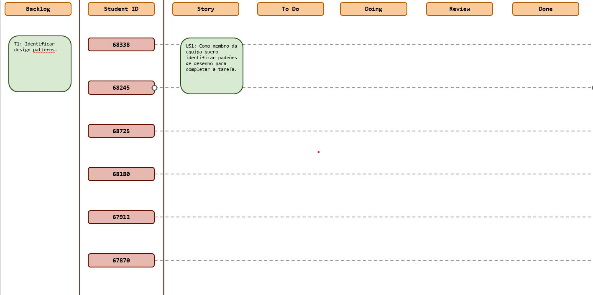
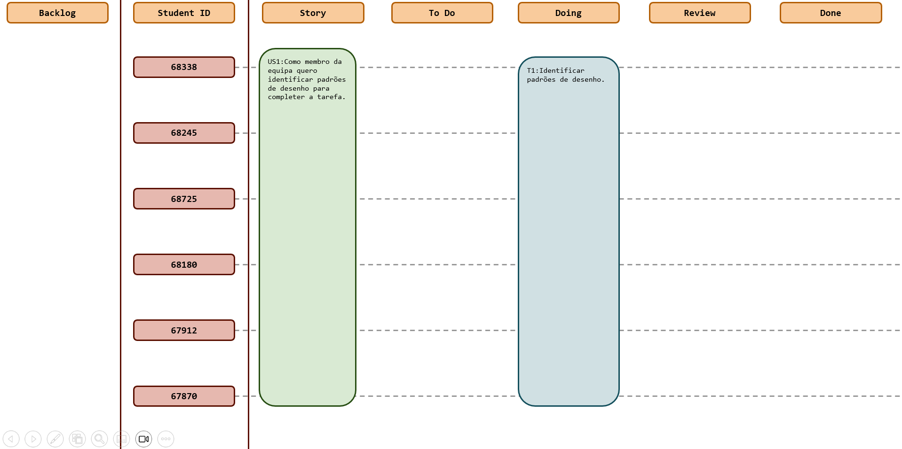

# Sprint 3

## Dates

2025-10-27 - 2025-11-02

## Scrum master

João Rodrigues 67912

## Management info
### Sprint Planning Meeting: 
Neste sprint o objetivo será identificar design patterns.

### Sprint Review Meeting: 
O objetivo do sprint não foi concluído conforme planeado, permancendo as tarefas para o próximo sprint, dado à falta de 
disponibilidade dos membros da equipa.

### Sprint Retrospective Meeting: 
Neste sprint devíamos ter-nos organizado melhor. Apesar de nenhum membro da equipa ter tido disponibilidade suficiente,
devíamos ter previsto a situação e ter começado mais cedo. Para os próximos sprints vamos ter de nos organizar melhor
garantindo tempo para realizar as tarefas.
## Relevant resources

### Scrum Board at the beginning of the sprint

### Scrum Board in the middle of the sprint

### Scrum Board at the end of the sprint

### Burndown Chart for the sprint

[Burndown Sprint 3](SE202526/Management/Sprint3/BurndownSprint3.xlsx)

### Gantt Chart

[Gantt Sprint 3](SE202526/Management/Sprint3/GantSprint3.xlsx)
