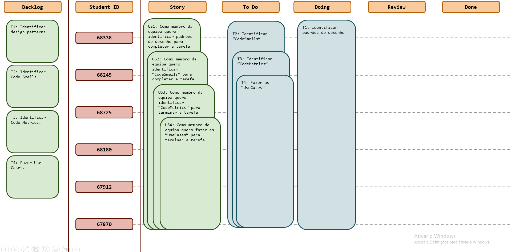
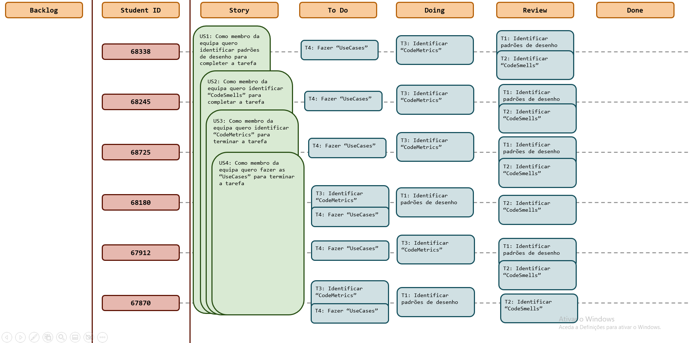
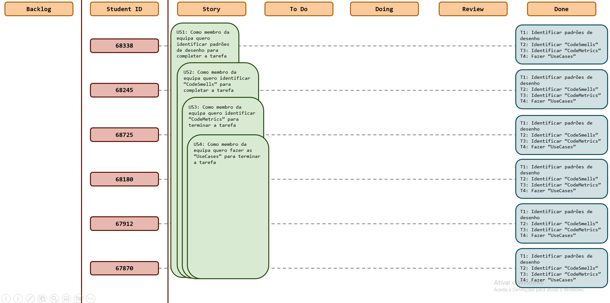

# Sprint 4

## Dates

2025-11-03 - 2025-10-09

## Scrum master

Tomás Silva 68725

## Management info
### Sprint Planning Meeting: 
Neste Sprint o objetivo será terminar as tarefas não concluídas do Sprint anterior, e ainda, terminar os objetivos da 
Milestone2, isto é, identificar os CodeSmells, as CodeMetrics e fazer as UseCases.

### Sprint Review Meeting: 
Os objetivos deste Sprint foram atingidos conforme planeado, não tendo restado tarefas para o próximo Sprint, todos os 
membros do grupo fizeram a sua parte e contribuiram para a realização do compromisso.

### Sprint Retrospective Meeting: 
Num ponto de vista geral o desempenho do grupo neste Sprint foi positivo, uma vez que cumprimos o que estava suposto 
para a semana. Porém no que toca à organização dos vários membros, é possível concluir que é de facto um ponto a melhor, 
devido à concentrção de tarefas concluídas num curto espaço de dias, quando o trabalho podia ser mais bem distribuído 
pela semana. No entanto, alguma falta de organização é compreenssível dado o facto da sobrecarga de trabalhos/testes das 
diversas cadeiras, posto isto, e o facto de termos cumprido os prazos previsto salientar novamente o bom desempenho do grupo.

## Relevant resources

### Scrum Board at the beginning of the sprint

### Scrum Board in the middle of the sprint

### Scrum Board at the end of the sprint

### Burndown Chart for the sprint

[BurndownSprint4.xlsx](BurndownSprint4.xlsx)

### Gantt Chart

[GanttSprint4.xlsx](GanttSprint4.xlsx)
