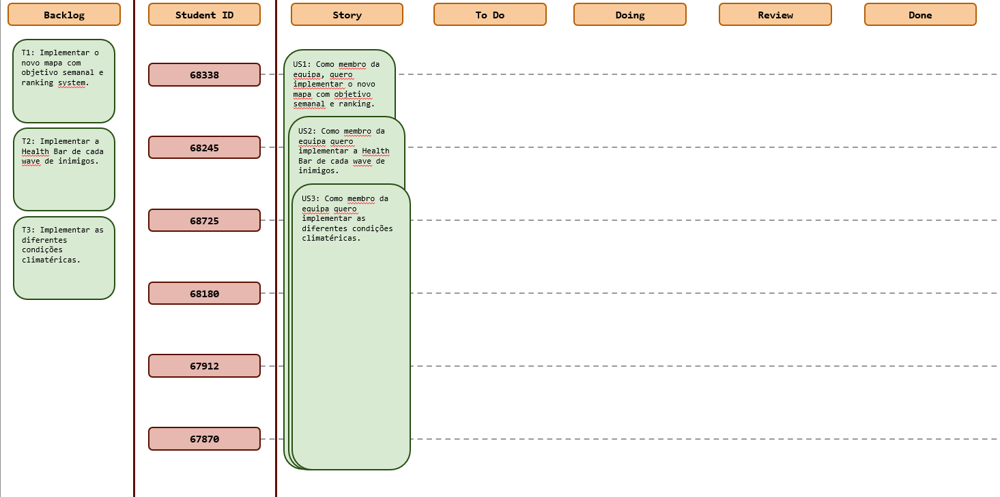
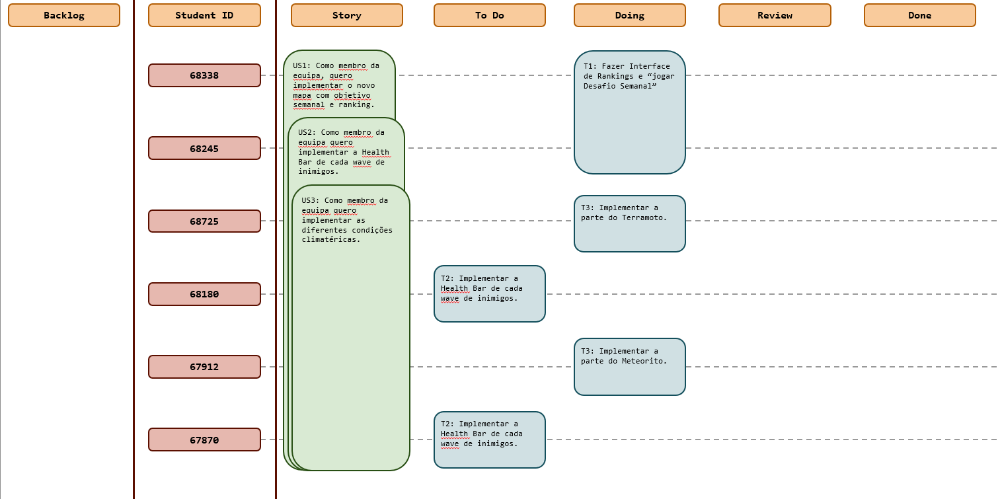
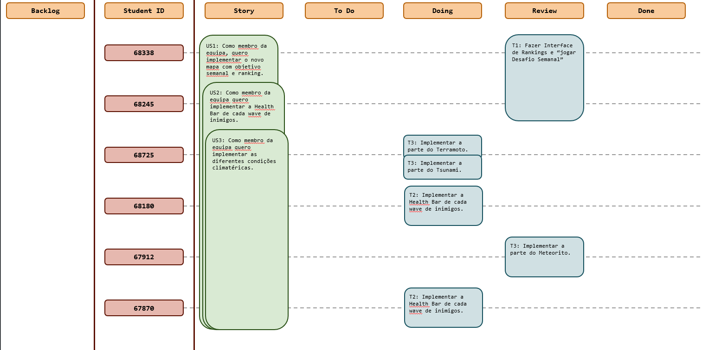

# Sprint 5

## Dates

2025-11-10 - 2025-11-16

## Scrum master

André Narquel 67870

## Management info
### Sprint Planning Meeting: 
Neste sprint, o objetivo será iniciar a implementação das novas funcionalidades e alterações definidas nos sprints 
anteriores, dando início ao desenvolvimento da Milestone 3.

### Sprint Review Meeting: 
Os objetivos da sprint foram maioritariamente cumpridos, ficando apenas algumas tarefas pendentes para serem finalizadas na próxima semana.

### Sprint Retrospective Meeting: 
O desempenho do grupo neste Sprint foi positivo, tendo sido realizada uma boa parte das implementações projetadas para esta semana.
Alguns membros começaram um pouco mais tarde o seu trabalho neste Sprint devido à entrega de um projeto de outra cadeira a meio do Sprint,
ainda assim todos progrediram de forma satisfatória nas suas tarefas.

## Relevant resources

### Scrum Board at the beginning of the sprint

### Scrum Board in the middle of the sprint

### Scrum Board at the end of the sprint

### Burndown Chart for the sprint

[BurndownSprint5.xlsx](BurndownSprint5.xlsx)

### Gantt Chart

[GanttSprint5.xlsx](GanttSprint5.xlsx)
