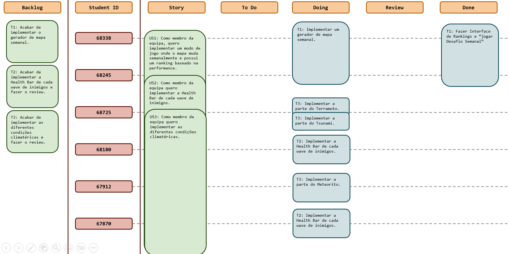
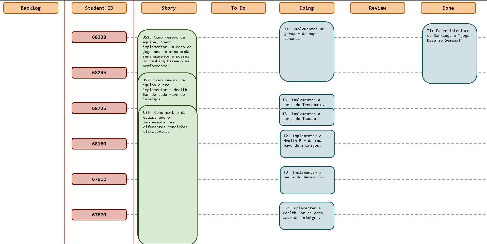
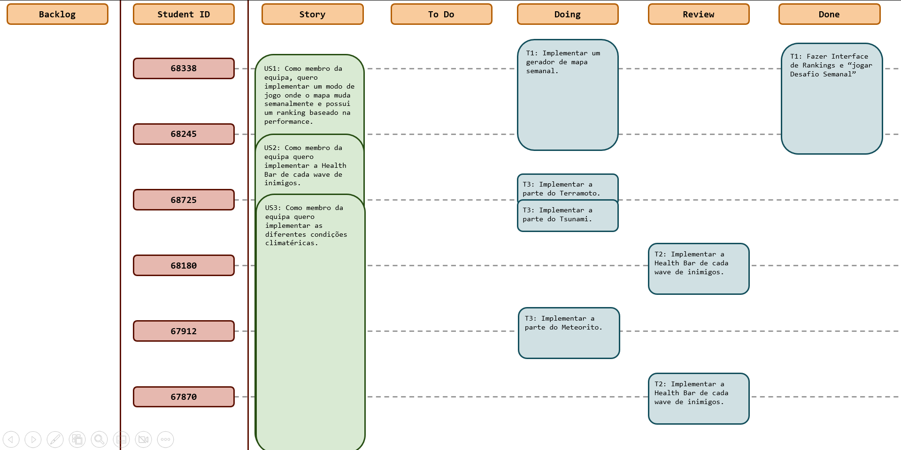

# Sprint 6

## Dates

2025-11-17 - 2025-11-23

## Scrum master

Joao Fernandes 68180

## Management info
### Sprint Planning Meeting: 
Neste Sprint o objetivo vai ser terminar as novas funcionalidades implementadas no jogo e dar review às mesmas.  

### Sprint Review Meeting: 
Apesar de nem todos os objetivos desta semana terem sido alcançados, foi feito um grande progresso em cada um, estando para breve a conclusão dos mesmos.  

### Sprint Retrospective Meeting: 
O desempenho do grupo neste Sprint foi positivo, com bom progresso na maioria das tarefas, apesar de alguns objetivos não terem sido totalmente concluídos. 
No próximo sprint, será importante melhorar a gestão do tempo de forma a conseguir alcaçar os objetivos delineados.

## Relevant resources

### Scrum Board at the beginning of the sprint

### Scrum Board in the middle of the sprint

### Scrum Board at the end of the sprint

### Burndown Chart for the sprint

[BurndownSprint6.xlsx](BurndownSprint6.xlsx)

### Gantt Chart

[GanttSprint6.xlsx](GanttSprint6.xlsx)
