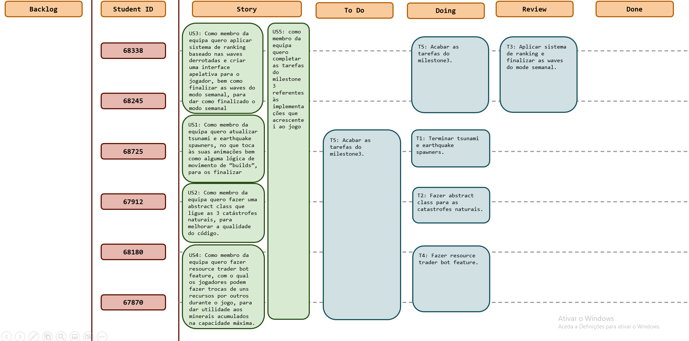
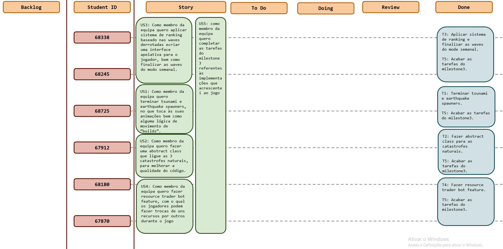

# Sprint 7

## Dates

2025-11-24 - 2025-12-04

## Scrum master

Student name and number

## Management info
### Sprint Planning Meeting: 
Para este sprint temos algumas tarefas para terminar, tais como o earthquake e tsunami spawners (eventualmente algum 
aprimoramento no meteorSpawner), o desafio semanal (sendo necessário melhorar as waves e fazer o ranking dos placements 
dos jogadores), mas também se decidiu acrescentar coisas como uma classe abstrata para as catástrofes naturais, e ainda 
um bot com o qual os jogadores poderão fazer trocas de recursos durante o jogo.

### Sprint Review Meeting: 
Os objetivos deste Sprint foram atingidos conforme planeado, terminando assim a resolução do projeto de Engenharia de 
Software, todos os membros do grupo fizeram a sua parte e contribuiram para a realização do compromisso.

### Sprint Retrospective Meeting: 
O desempenho do grupo neste Sprint foi bastante positivo, uma vez que cumprimos o que estava suposto
para o sprint. Terminamos, assim o trabalho de Engenharia de Software dentro do prazo estipulado. Olhando de um ponto de 
vista geral de todo o progresso deste trabalho podemos salientar que a entreajuda e o compromisso de todos os membros 
desta equipa foi a chave para a realização destre trabalho.

## Relevant resources

### Scrum Board at the beginning of the sprint

### Scrum Board in the middle of the sprint

### Scrum Board at the end of the sprint

### Burndown Chart for the sprint

[BurndownSprint7.xlsx](BurndownSprint7.xlsx)

### Gantt Chart

[GanttSprint7.xlsx](GanttSprint7.xlsx)
