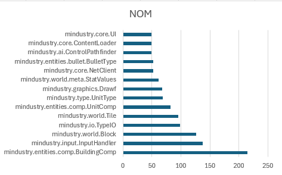
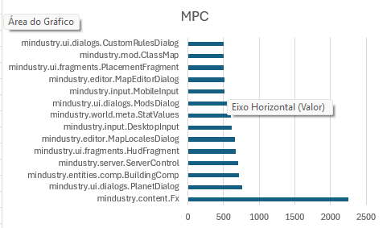
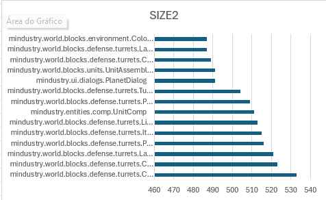
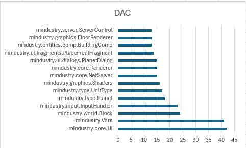

# Code Metrics - Li-Henry Metrics Set

## Change log
- 7/11/2025 André Narquel

# Number Of Methods - NOM

This metric measures the total number of methods implemented within a class. It reflects how much behavior or 
functionality a single class is responsible for handling.

Here are the worst values found in the codebase:

Low/Common NOM (0–7): Simple and focused class with limited responsibilities.

Medium/Casual NOM (7–14): Acceptable complexity.

High/Uncommon NOM (14+): Complex or overloaded class.

A high NOM value suggests that a class performs too many tasks, combining logic that should be distributed among 
multiple, smaller classes. This makes the class harder to understand, test, and modify safely. It often correlates with 
low cohesion and excessive responsibility concentration, violating the Single Responsibility Principle. In terms of 
maintainability, reducing NOM by splitting functionalities into helper or subclass structures increases modularity and 
simplifies debugging, improving the overall design quality of the system.

# Message Passing Coupling - MPC
This metric measures how many method calls a class makes to other classes, showing its level of dependency and coupling
within the system.

Here are the worst values found in the codebase:

Low Coupling – modular and easy to maintain.

Moderate Coupling – acceptable.

High Coupling – potential Feature Envy or Inappropriate Intimacy code smell.

A high MPC value means the class relies too heavily on external classes, making it harder to modify or test without 
affecting others. This often indicates poor encapsulation and weak cohesion. To improve design, dependencies should be 
reduced by moving logic closer to the data or introducing helper classes.

# Number Of Attributes and Methods - SIZE2
This metric measures the total number of attributes and methods defined within a class. It provides an overall
indication of the class size and complexity, helping identify whether a class may be taking on too many responsibilities.

Here are the worst values found in the codebase:

Low NOM: Indicates a small, focused class with limited responsibilities.

Moderate NOM: Acceptable for moderately complex classes.

High NOM: Suggests a Large Class code smell. The class likely performs multiple unrelated tasks and violates 
the Single Responsibility Principle.

A high NOM means the class contains too many fields and behaviors, making it harder to understand, maintain, and extend.
Such classes often become central “god classes” that know or do too much, increasing coupling and reducing modularity.
In contrast, a low NOM reflects better cohesion, with each class focused on a clear and specific purpose, 
improving readability and testability.

# Data Abstraction Coupling - DAC
This metric measures the number of abstract data types (i.e., user-defined classes) that a given class depends on
through its attributes, parameters, or local variables. It reflects how strongly a class is coupled to other classes 
in the system.

Here are the worst values found in the codebase:

Low DAC: Indicates low coupling — the class is relatively independent and easier to maintain.

Moderate DAC: Acceptable, some dependency is normal for collaboration between classes.

High DAC: Suggests potential Inappropriate Intimacy code smell, as the class depends on too many others.

A high DAC value means the class interacts with many different abstractions, making it more complex and fragile.
Changes in related classes can easily propagate and cause unexpected behavior, reducing modularity and increasing
maintenance effort.
In contrast, a low DAC value implies that the class is loosely coupled and more self-contained,
improving reusability and reducing the risk of side effects when modifying dependencies.