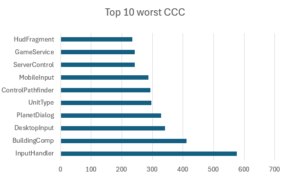

# Code metrics - G. Ann Campbell Metrics Set

# Change Log
  7/11/2025 - Joao Fernandes
  
# Class Cognitive Complexity - CCC

  CCC measures the overall decision complexity of a class by summing the cyclomatic complexity of all its methods. It 
  reflects how difficult the control flow of the class is to understand, test, and maintain.
  
  Regular range: [0..10]

  Acceptable range: [11..31]
  
  High range: (32<)

  A high CCC value indicates that the class has too many conditional branches, loops, or complex logic, which increases
  the chance of errors and makes testing a lot more difficult. A high CCC might end up being an indicator of some code 
  smells, mainly the Large Method Code Smell, because if it has a lot of cyclic operations, it most likely will have a
  method that´s to big. It can also indicate that you could have a Long Parameter List Code Smell, because having too 
  many cyclic operations can be because you can have to do many decisions with different parameters. Putting all of this
  together might also end up being a Large Class Code Smells, because it can result in a class with too many responsibilities 
  that could be divided in other classes. Reducing it may involve splitting large methods, simplifying conditions, or 
  distributing logic across smaller, focused classes, which would resolve as well most of the Code Smells.

  Here are some examples of the worst classes in terms of CCC
  
  
  
