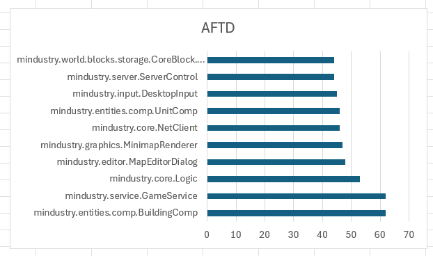
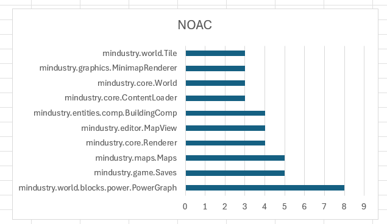
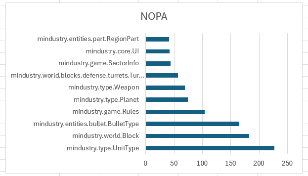
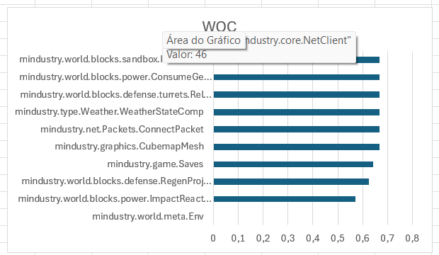

## Code Metrics

## Change Log
 - 7/11/2025 Joao Rodrigues

   The metric set that I analyze in this report is the Lanza-Marinescu Metrics Set.

   
# Access to Foreign Data

   The access to foreign data counts the number of distinct attributes of other classes that a given class accesses, 
   this includes direct access and indirect access via getters/setters.

   

   Interpretation:

   0-3     low coupling, good encapsulation
   3-6     moderate coupling, acceptable but should be monitored
   6<      high coupling, class may violate encapsulation principles

   High ATFD values suggest that the class is handling too much of other classes internal data, a potential Feature envy
   smell, meaning that the class may be performing operations that would better belong to the foreign class itself. High
   AFTD values reduce maintainability, since any change in a foreign class may require modifications in multiple dependent
   classes, this tight coupling increases the risk of introducing bugs, where a small change propagates through many 
   parts of the system. On the other hand, low AFTD is easy to maintain and has safer refactoring. Regarding efficiency,
   AFTD is mostly related to development efficiency, high coupling makes understanding and modifying the code slower, 
   since developers must trace multiple relationships between classes.

# Number Of Accessor Methods

   The number of accessor methods(NOAC) measures how many methods in a class are accessor methods(getting/setters).

   

   Interpretation:

   0-2     strong encapsulation, attributes are not freely exposed.
   3-4     moderate encapsulation, some uses of getters/setters
   5<      weak encapsulation, class acts as a data holder("Data Class")

   High NOAC values can reduce maintainability, when too many accessors exist, external classes may rely on the internal
   structure of a class, making harder to change without affecting other parts of the system. In contrast, a low NOAC
   value hides information, allowing developers to redesign a class with minimal impact elsewhere. About efficiency, a 
   high number of accessors increases the time developers spend tracing how and where the data is used. When many 
   accessors exist, it becomes easy for other classes to manipulate internal data directly via getters/setters, leading
   to 

# Number of Public Attributes

   This metric counts the number of public attributes of a class.

   

   Interpreter:

   0       Ideal encapsulation, class hides all its internal data
   1-3     Acceptable, limited exposure for special cases
   3<      Poor encapsulation, class exposes too much internal state

   High NOPA values reduces maintainability, since external classes can directly modify a class internal state, fragile
   design. Regarding efficiency direct public access may seem faster or simpler to use, but it can cause inconsistent
   states and debugging difficulties. In contrast, keeping fields private and using controlled accessors improve long-term
   efficiency in development and maintenance.

# Weight Of A Class

   This metric measure the relative number of functional members compared to all members of a class. It’s computed by 
   dividing the number of public functional members by the total number of public members. The goal of this metric is to
   assess the degree of functionality provided by the class compared to the amount of exposed data.

   

   Interpretation:

   0,33>        data-heavy class, likely a Data Class smell
   0,33-0,5     balanced-acceptable but could be improved
   0,5<         encapsulated and functional

   A low WOC indicates a class that exposes too much internal data and performs little behaviour, which can make the
   system hard to evolve safely and a high WOC encapsulates its logic, making changes localized and easier to manage.
   In terms of efficiency a high WOC promotes cohesive design, where each class provides clear and independent
   functionality, improving code comprehension and productivity and a low WOC requires developers to handle logic 
   externally, leading to slower development.

## Sample of different metrics value

# AFTD

  

# NOAC

   

# NOPA
   
   

# WOC

   
   