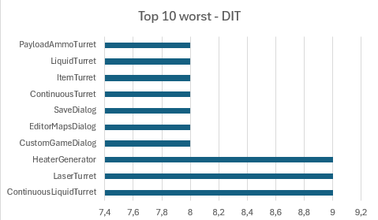
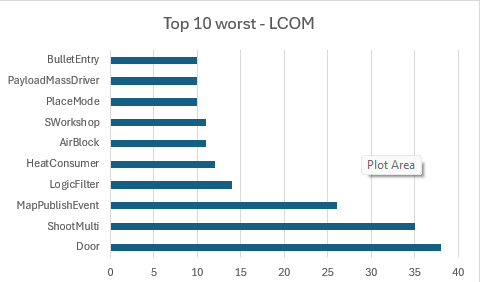
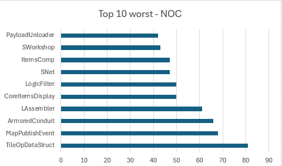

# Code metrics - Chidamber-Kemerer Metric Set

## Change log
- 7/11/2025 Tomás Silva

# Depth Of Inheritance - DIT

DIT is defined as the length of the longest path from the class in question to the root of the class hierarchy. 
Mathematically, it is the number of nodes along the longest path from the class under analysis to the root node of the 
inheritance hierarchy. (Basically it indicates how many classes are above it in the inheritance chain).

Regular range: [0..3]

Acceptable range: [4..5]

High range: (5<)

A DIT extremely high increases complexity, making it hard to foresee the behaver of the class due to the fact that ths 
classes in cause inherits lots of code from different "mother" classes. Which can also lead to many methods/attributes 
not needed/used in the class, a clear sinal of bad Inheritance Hierarchy.

Top 10 worst classes in terms of DIT:

# Lack Of Cohesion Of Methods - LCOM

The Lack of Cohesion of Methods (LCOM) metric is a software quality metric used to measure the degree of cohesion within 
a class. Cohesion refers to how related and focused the functionalities (methods and variables) are within a class.

High Cohesion (low LCOM):

- Indicates that the class is well-structured and focuses on a single responsibility (adhering to the Single Responsibility 
Principle - SRP).

- All methods work together and use the same attributes of the class.

Low Cohesion (high LCOM):

- Suggests that the class is performing multiple, unrelated responsibilities.

- This makes the class complex, difficult to maintain, and more error-prone.

Regular range: 1

High range: (2<)

Concluding A high value of LCOM (low cohesion), leads to the Code Smell "Divergent Class", happens when a class assumes 
many responsibilities, this suggests that the class drifted from its primary goal and may show signs of overload with 
methods and responsibilities that do not logically belong to a single class.

Top 10 worst classes in terms of LCOM:

# Number Of Children - NOC

The NOC metric measures the breadth of the class hierarchy at a given level. The NOC of a class is simply the number of 
direct and immediate subclasses that inherit from that class.

Regular range: [0..2]

Acceptable range: [3..5]

High range: (5<)

An elevated value of NOC indicates that the class is inherited by many subclasses (children), which makes it a central 
and fragile point of the sistem. An alteration in a class with a high NOC will propagate throughout their children (subclasses)
leading to the Code Smell "Shotgun Surgery", that makes the code liable to failure and most of all harder to work with 
when correcting it.

Top 10 worst classes in terms of NOC:
