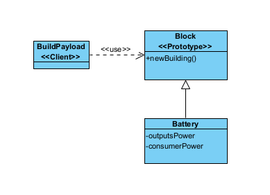
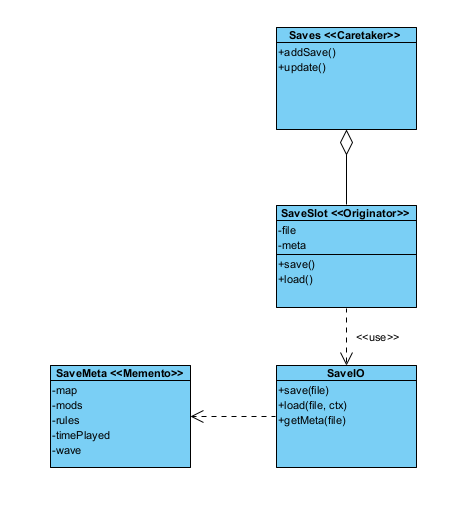
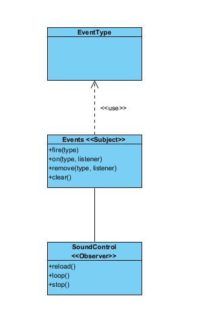

## Design Patterns

# Change log
- 7/11/2025 André Narquel

# Prototype
Path: core/src/mindustry/world/blocks/payloads/BuildPayload.java
Path: core/src/mindustry/world/Block.java
Path: core/src/mindustry/world/blocks/power/Battery.java

The program uses Prototype Pattern to create new instances of blocks based on existing models. The BuildPayload class is
an example of a client using this pattern.

When BuildPayload needs to create a new battery on the map, it does not instantiate the Battery from scratch.
Instead, it calls battery.newBuilding().create(battery, team), which returns a new instance of the battery based on 
the original model (Battery). The original block functions as a Prototype, providing a template for generating new 
instances that can be modified or placed on the map without affecting the base battery.

Benefits:

Avoids code duplication: there is no need to recreate all properties and logic for each new battery.

Flexible for variants: new batteries can be created with minor modifications from the original model.

Easier maintenance: changes to the base battery can be reflected in all clones created from it, ensuring consistency 
throughout the game.

The battery example is one of dozens of possible blocks created by this system, it is just 1 of many types of blocks.

//Code snippet

    ---------// BuildPayload Class //-------------
    (...)
    public BuildPayload(Block block, Team team){
    this.build = block.newBuilding().create(block, team);
    this.build.tile = emptyTile;
    }

    ---------// Battery Class //------------------
    public class Battery extends PowerDistributor{
    public @Nullable DrawBlock drawer;

    public Color emptyLightColor = Color.valueOf("f8c266");
    public Color fullLightColor = Color.valueOf("fb9567");

    public Battery(String name){
        super(name);
        outputsPower = true;
        consumesPower = true;
        canOverdrive = false;
        flags = EnumSet.of(BlockFlag.battery);
        //TODO could be supported everywhere...
        envEnabled |= Env.space;
        destructible = true;
        //batteries don't need to update
        update = false;
    }
    (...)

    ---------// Block Class //-------------
    (...)    
    public final Building newBuilding(){
        return buildType.get();
    }
    (...)

    
# Memento
Path: core/src/mindustry/Saves.java
Path: core/src/mindustry/io/SaveIO.java
Path: core/src/mindustry/Saves.java (inner class SaveSlot)

The program uses the Memento Pattern to save and restore the state of the game. The Saves class is an example of a
client using this pattern, while SaveMeta acts as the Memento storing the internal state of the game.
When the game needs to save the current state, it does not expose the internal details of the world, units, or blocks.
Instead, it calls SaveSlot.save(), which internally serializes the current state into a SaveMeta object (the Memento).
Later, this Memento can be used to restore the game to the saved state by calling SaveSlot.load().
The Saves class acts as the Caretaker, managing all save slots, deciding when to save or load a Memento. This ensures
that the game state can be restored without exposing internal structures of the world, units, or other objects.

Benefits:

Encapsulation: game state is saved without exposing internal representation of objects.

Restore capability: allows restoring the game to a previous state reliably.

Consistency: saves and restores include all necessary data (time played, map state, units, rules).

//Code snippet
    
    public class SaveIO{
    /** Save format header. */
    public static final byte[] header = {'M', 'S', 'A', 'V'};
    public static final IntMap<SaveVersion> versions = new IntMap<>();
    public static final Seq<SaveVersion> versionArray = Seq.with(new Save1(), new Save2(), new Save3(), new Save4(), new Save5(), new Save6(), new Save7(), new Save8(), new Save9(), new Save10());

    static{
        for(SaveVersion version : versionArray){
            versions.put(version.version, version);
        }
    }

    public static SaveVersion getSaveWriter(){
        return versionArray.peek();
    }

    public static @Nullable SaveVersion getSaveWriter(int version){
        return versions.get(version);
    }

    public static void save(Fi file){
        boolean exists = file.exists();
        if(exists) file.moveTo(backupFileFor(file));
        try{
            write(file);
        }catch(Throwable e){
            if(exists) backupFileFor(file).moveTo(file);
            throw new RuntimeException(e);
        }
    }
    (...)

    ---------------------//-------------------
    public class Saves{
    (...)
    public Saves(){
        Core.assets.setLoader(Texture.class, ".spreview", new SavePreviewLoader());

        Events.on(StateChangeEvent.class, event -> {
            if(event.to == State.menu){
                totalPlaytime = 0;
                lastTimestamp = 0;
                current = null;
            }
        });
    }

    public void load(){
        (...)
        }

    public void update(){
        if(current != null && state.isGame()
        && !(state.isPaused() && Core.scene.hasDialog())){
            if(lastTimestamp != 0){
                totalPlaytime += Time.timeSinceMillis(lastTimestamp);
            }
            lastTimestamp = Time.millis();
        }

        if(state.isGame() && !state.gameOver && current != null && current.isAutosave()){
            time += Time.delta;
            if(time > Core.settings.getInt("saveinterval") * 60 && !Vars.disableSave){
                saving = true;

                try{
                    current.save();
                }catch(Throwable t){
                    Log.err(t);
                }

                Time.runTask(3f, () -> saving = false);

                time = 0;
            }
        }else{
            time = 0;
        }
    }

# Observer

Path: core/src/mindustry/audio/SoundControl.java
Path: core/src/mindustry/game/EventType.java
Path: arc/Events.java 

The program uses the Observer Pattern to allow the SoundControl class to react to game events without tightly coupling 
it to the game logic. In this setup, EventType acts as the Subject, managing a list of subscribers and triggering 
notifications when events occur. SoundControl acts as the Observer, subscribing to specific events such as WaveEvent 
or ResetEvent to control audio playback dynamically.

When an event occurs in the game, the corresponding EventType instance calls all registered observers’ callbacks. 
For example, when a WaveEvent is triggered, SoundControl receives the notification and may play ambient, dark, or boss 
music based on the game state. This ensures that SoundControl can react to changes without needing direct knowledge of 
the game’s internal logic or state management.

Benefits:

SoundControl doesn’t need to know the internal details of the game or manually poll for changes.
Music and sound effects respond automatically to game events such as waves or boss spawns.

Scalability: New observers or event types can be added without modifying existing code, making the audio system 
flexible and maintainable.

In the snippet below we can see one example - the music runs 10 seconds after a wave spawns, reacting to the action,
right as an Observer

In the snippet below we can see one example - the music runs 10 seconds after a wave spawns, reacting to the action,
right as an Observer

//Code snippet
        
     public SoundControl(){
        Events.on(ClientLoadEvent.class, e -> reload());

        //only run music 10 seconds after a wave spawns
        Events.on(WaveEvent.class, e -> Time.run(Mathf.random(8f, 15f) * 60f, () -> {
            boolean boss = state.rules.spawns.contains(group -> group.getSpawned(state.wave - 2) > 0 && group.effect == StatusEffects.boss);

            if(boss){
                playOnce(bossMusic.random(lastRandomPlayed));
            }else if(Mathf.chance(musicWaveChance)){
                playRandom();
            }
        }));

        setupFilters();

        Events.on(ResetEvent.class, e -> {
            lastPlayed = Time.millis();
        });
    }

    ----------------//-----------------------
    public class Events{
    private static final ObjectMap<Object, Seq<Cons<?>>> events = new ObjectMap<>();

    /** Handle an event by class. */
    public static <T> void on(Class<T> type, Cons<T> listener){
        events.get(type, () -> new Seq<>(Cons.class)).add(listener);
    }

    /** Handle an event by enum trigger. */
    public static void run(Object type, Runnable listener){
        events.get(type, () -> new Seq<>(Cons.class)).add(e -> listener.run());
    }

    /** Only use this method if you have the reference to the exact listener object that was used. */
    public static <T> boolean remove(Class<T> type, Cons<T> listener){
        return events.get(type, () -> new Seq<>(Cons.class)).remove(listener);
    }

    /** Fires an enum trigger. */
    public static <T extends Enum<T>> void fire(Enum<T> type){
        Seq<Cons<?>> listeners = events.get(type);

        if(listeners != null){
            int len = listeners.size;
            Cons[] items = listeners.items;
            for(int i = 0; i < len; i++){
                items[i].get(type);
            }
        }
    }
