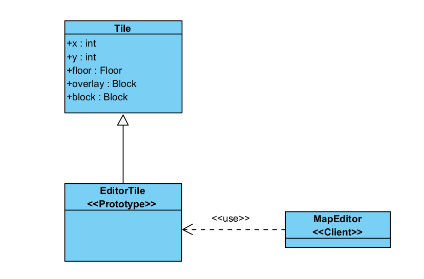
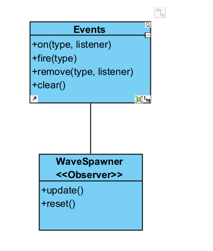
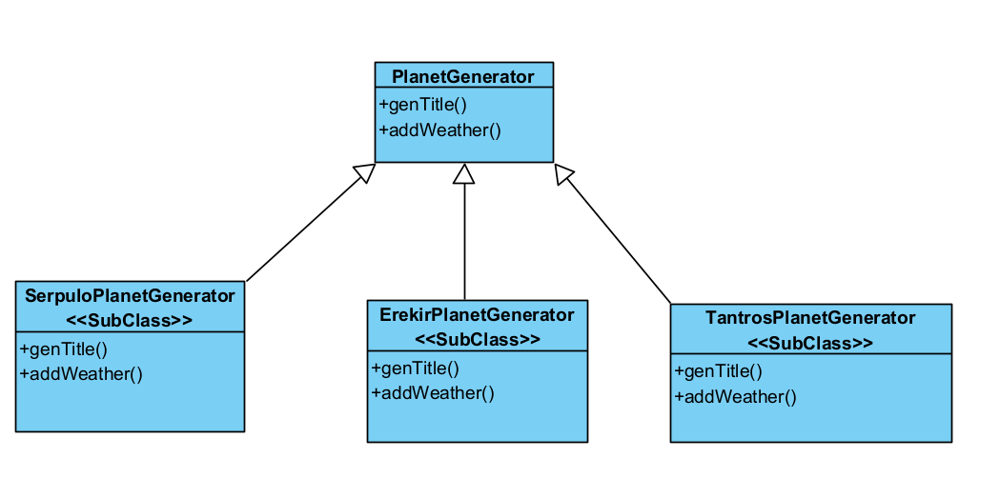

## Design Patterns

# Change log
- 7/11/2025 Joao Fernandes

# Prototype

  Path: core/src/mindustry/editor/MapEditor.Java
        core/src/mindustry/editor/EditorTile.Java
        core/src/mindutry/world/Tile.Java

  In this case the class EditorTile extends Tile, serving as the prototype that customizes the inherited behavior for the map
  editing context like, tile placement, rotation, and team assignment. Finally, the MapEditor class functions as the client, 
  since it is responsible for creating and managing EditorTile instances instead of normal Tile objects when loading or
  editing maps. This design allows the editor to reuse the Tile structure while providing specialized editing functionality,
  demonstrating a clear application of the Prototype design pattern.

  //Code snippets

      public class EditorTile extends Tile{

      public EditorTile(int x, int y, int floor, int overlay, int wall){
        super(x, y, floor, overlay, wall);
      }
      ...
      }

      public class MapEditor{
        ...
        public void updateRenderer(){
          ...
          tiles.seti(i, new EditorTile(tile.x, tile.y, tile.floorID(), tile.overlayID(), build == null ? tile.blockID() : 0));
          ...
        }
        ...
      }

# Observer

  Path: core/src/mindustry/ai/WaveSpawner
        arc/Events.java 

  In this class, we can see the Observer Design Pattern. It registers event listeners through the global Events system, 
  subscribing to notifications such as WorldLoadEvent and TileOverlayChangeEvent. When these events are fired elsewhere
  in the program, the corresponding callback methods inside WaveSpawner, like reset(), are automatically executed. This
  allows the class to react to changes in the game. By using the Events system as a centralized publisher, the architecture
  remains modular, extensible, and easy to maintain.

  //Code snippet

    public class WaveSpawner{
         public WaveSpawner(){
            Events.on(WorldLoadEvent.class, e -> reset());
    
            Events.on(TileOverlayChangeEvent.class, e -> {
                if(e.previous == Blocks.spawn) spawns.remove(e.tile);
                if(e.overlay == Blocks.spawn) spawns.add(e.tile);
            });
        }
        ...
    }

# Template Method

  Path: core/src/mindustry/maps/generators/PlanetGenerator.Java
        core/src/mindustry/maps/planet/ErekirPlanetGenerator.Java
        core/src/mindutry/maps/planet/SerpuloPlanetGenerator.Java
        core/src/mindustry/maps/planet/TantrosPlanetGenerator.Java

  In this class, we can see the Template Method Design Pattern. It defines the overall structure for generating a planet in the 
  generate() method, which is the template. This method outlines the sequence of steps involved in planet generation but
  delegates the specifics to subclasses. For example, the TantrosPlanetGenerator(), ErekirPlanetGenerator() and 
  SerpuloPlanetGenerator() classes override methods like genTile() and addWeather() to provide the specific implementation
  for generating terrain and weather. The pattern ensures a consistent algorithm structure while allowing subclasses to 
  customize certain steps without altering the overall flow of the process.

  //Code snippets
  
        public abstract class PlanetGenerator extends BasicGenerator implements HexMesher{
            
            ...
            public void generate(Tiles tiles, Sector sec, WorldParams params){
                this.tiles = tiles;
                this.seed = params.seedOffset + baseSeed;
                this.sector = sec;
                this.width = tiles.width;
                this.height = tiles.height;
                this.rand.setSeed(sec.id + params.seedOffset + baseSeed);

                TileGen gen = new TileGen();
                for(int y = 0; y < height; y++){
                for(int x = 0; x < width; x++){
                    gen.reset();
                    Vec3 position = sector.rect.project(x / (float)tiles.width, y / (float)tiles.height);

                    genTile(position, gen);
                    tiles.set(x, y, new Tile(x, y, gen.floor, gen.overlay, gen.block));
                }
            }

            generate(tiles, params);
    }
        }

    