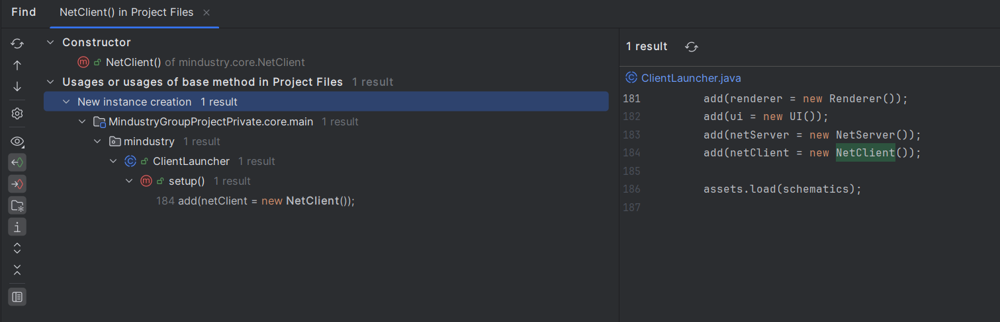
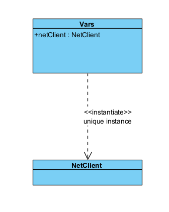
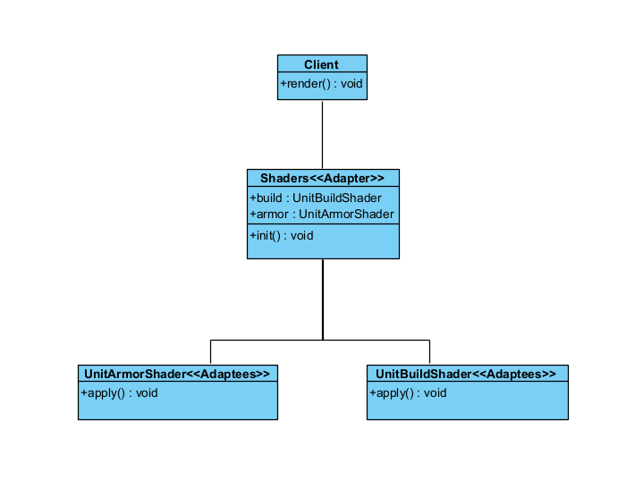

## Design Patterns

# Change log
   - 5/11/2025 Joao Rodrigues

# Template Method

   Path: core/src/mindustry/entities/abilities
   Package: mindustry.entities.abilities;
   Classes: Ability.java, ArmorPlateAbility.java, ForceFieldAbility.java
   Methods: update(), addStats(), draw()

  The Ability class defines the framework for a unit's ability behavior, defines a general structure for how abilities
  should behave during the game through methods like update(), addStats(), draw(). Subclasses like ArmorPlateAbility, 
  ForceFieldAbility,..., extend this abstract class and override these methods to provide specific functionality. This 
  design follows the template method because the base class creates the skeleton, while subclasses override particular 
  steps without changing overall flow. Here Ability provides the methods update(), addStats(), draw() and subclasses 
  override them.

//Code snippet

    //Base class
    public abstract class Ability{
    ...
        public void update(Unit unit){}                                             //line 16
        public void draw(Unit unit){}                                               //line 18 
        public void addStats(Table t){                                              //line 37
        if(Core.bundle.has(getBundle() + ".description")){
            t.add(Core.bundle.get(getBundle() + ".description")).wrap().width(descriptionWidth);
            t.row();
        }
    }
    ...
    }

    //Subclasses

    public class ArmorPlateAbility extends Ability{
    public void update(Unit unit){                                                  //line 32
        super.update(unit);
        warmup = Mathf.lerpDelta(warmup, unit.isShooting() ? 1f : 0f, 0.1f);
        unit.healthMultiplier += warmup * healthMultiplier;
    }
    public void addStats(Table t){                                                  //line 40
        super.addStats(t);
        t.add(abilityStat("damagereduction", Strings.autoFixed(-healthMultiplier * 100f, 1)));
    }
    public void draw(Unit unit){                                                    //line 46
        if(!drawPlate && !drawShine) return;

        if(warmup > 0.001f){
            if(plateRegion == null){
                plateRegion = Core.atlas.find(unit.type.name + plateSuffix, unit.type.region);
                shineRegion = Core.atlas.find(unit.type.name + shineSuffix, plateRegion);
            }

            float pz = Draw.z();
            if(z > 0) Draw.z(z);

            if(drawPlate){
                Draw.alpha(warmup);
                Draw.rect(plateRegion, unit.x, unit.y, unit.rotation - 90f);
                Draw.alpha(1f);
            }

            if(drawShine){
                Draw.draw(Draw.z(), () -> {
                    Shaders.armor.region = shineRegion;
                    Shaders.armor.progress = warmup;
                    Shaders.armor.time = -Time.time / 20f * shineSpeed;

                    Draw.color(color == null ? unit.team.color : color);
                    Draw.shader(Shaders.armor);
                    Draw.rect(shineRegion, unit.x, unit.y, unit.rotation - 90f);
                    Draw.shader();

                    Draw.reset();
                });
            }

            Draw.z(pz);
        }
    }
    }

    public class ForceFieldAbility extends Ability{
    public void update(Unit unit){                                                  //line 80
        if(unit.shield <= 0f && !wasBroken){
            unit.shield -= cooldown * regen;

            Fx.shieldBreak.at(unit.x, unit.y, radius, unit.type.shieldColor(unit), this);
        }

        wasBroken = unit.shield <= 0f;

        if(unit.shield < max){
            unit.shield += Time.delta * regen;
        }

        alpha = Math.max(alpha - Time.delta/10f, 0f);

        if(unit.shield > 0){
            radiusScale = Mathf.lerpDelta(radiusScale, 1f, 0.06f);
            paramUnit = unit;
            paramField = this;
            checkRadius(unit);

            Groups.bullet.intersect(unit.x - realRad, unit.y - realRad, realRad * 2f, realRad * 2f, shieldConsumer);
        }else{
            radiusScale = 0f;
        }
    }
    public void addStats(Table t){                                              //line 68
        super.addStats(t);
        t.add(Core.bundle.format("bullet.range", Strings.autoFixed(radius / tilesize, 2)));
        t.row();
        t.add(abilityStat("shield", Strings.autoFixed(max, 2)));
        t.row();
        t.add(abilityStat("repairspeed", Strings.autoFixed(regen * 60f, 2)));
        t.row();
        t.add(abilityStat("cooldown", Strings.autoFixed(cooldown / 60f, 2)));
    }
    public void draw(Unit unit){                                                //line 117
        checkRadius(unit);

        if(unit.shield > 0){
            Draw.color(unit.type.shieldColor(unit), Color.white, Mathf.clamp(alpha));

            if(Vars.renderer.animateShields){
                Draw.z(Layer.shields + 0.001f * alpha);
                Fill.poly(unit.x, unit.y, sides, realRad, rotation);
            }else{
                Draw.z(Layer.shields);
                Lines.stroke(1.5f);
                Draw.alpha(0.09f);
                Fill.poly(unit.x, unit.y, sides, radius, rotation);
                Draw.alpha(1f);
                Lines.poly(unit.x, unit.y, sides, radius, rotation);
            }
        }
    }
    }

Class Diagram:

# Singleton

   Path: core/src/mindustry/Vars.java
   Package: mindustry;
   Instantiation: core/scr/mindustry/ClientLauncher.java, method setup()
   UniqueInstance: NetClient
   Global Access: Vars.netClient

  The NetClient instance is an example of the Singleton design pattern. The variable public static NetClient netClient
  is declared in the Vars class and instantiated only once in ClientLauncher.setup() method and its reused globally 
  throughout the codebase via Vars.netClient. Although this implementation does not follow the classic getInstance() 
  structure, it achieves the same design goals. Ensures a single instance of the Netclient object and provides a global
  access point to it. This guarantees consistent communication management across the game and prevents multiple network
  clients from being created.

  //Code snippet

    public class Vars{
    ...
    public static NetClient netClient;                              //line 287
    ...
    }

    public abstract class ClientLauncher{
    ...
    public void setuo(){
    ...
    add(netClient = new NetClient());                               //line 184
    ...
    }
    ...
    }

Unique instance proof: 

Class Diagram: 

# Adapter

   Path: core/src/mindustry/graphics/Shaders.java
   Package: mindustry.graphics;
   Classes: Shaders.java, UnitArmorShader.java, UnitBuildShader.java
    

   The Shaders class serves as an Adapter, providing a uniform interface for multiple specialized shader classes. Each
   concrete shader(UnitArmorShader, DarknessShader, ...) implements its own logic, while Shaders expose them via static
   fields. This allows the game to use all shaders without being coupled to their specific implementations, enabling 
   incompatible interface to work together.

   //Code snippet

    //Adapter
     
    public class Shaders{
    ...
    public static UnitBuildShader build;                                    //line 24
    public static UnitArmorShader armor;                                    //line 25
    ...
    public static void init(){                                              //line 39
    ...
    armor = new UnitArmorShader();
    darkness = new DarknessShader();
    ...
    }
    ...
    

    //Adaptees
    
    }
    public static class UnitArmorShader extends LoadShader{                 //line 218
        public float progress, time;
        public TextureRegion region;

        public UnitArmorShader(){
            super("unitarmor", "default");
        }

        @Override
        public void apply(){
            setUniformf("u_time", time);
            setUniformf("u_progress", progress);
            setUniformf("u_uv", region.u, region.v);
            setUniformf("u_uv2", region.u2, region.v2);
            setUniformf("u_texsize", region.texture.width, region.texture.height);
        }
    }

    public static class UnitBuildShader extends LoadShader{                 //line 198
        public float progress, time;
        public Color color = new Color();
        public TextureRegion region;

        public UnitBuildShader(){
            super("unitbuild", "default");
        }

        @Override
        public void apply(){
            setUniformf("u_time", time);
            setUniformf("u_color", color);
            setUniformf("u_progress", progress);
            setUniformf("u_uv", region.u, region.v);
            setUniformf("u_uv2", region.u2, region.v2);
            setUniformf("u_texsize", region.texture.width, region.texture.height);
        }
    }

Class Diagram: 

    

   