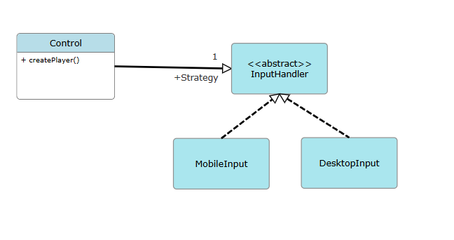
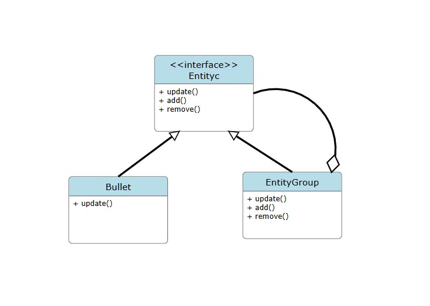

## Design Patterns

# Change log
   - 6/11/2025 Tomás Silva

# Factory Method

   Path: core\src\mindustry\content\Liquids.java
   Path: core\src\mindustry\type\Liquid.java
   Path: core\src\mindustry\type\CellLiquid.java 
   Path: core\src\mindustry\core\ContentLoader.java

  The class "Liquids" is the "ConcreteCreator" overrides the factory method to return an instance of a ConcreteProduct 
  (Factory Object/Method). The classes "Liquid" and "CellLiquid" are two "ConcreteProducts" contains the actual
  implementation of the objets ("Products") the Factory Method creates. For Last, the class ContentLoader is the one 
  that calls the method "load()" on "Liquids" representing the "Client"

//Code snippet
    
    //Liquid 
    public class Liquids{

    public static Liquid water, slag, oil, cryofluid,
    arkycite, gallium, neoplasm,
    ozone, hydrogen, nitrogen, cyanogen;

    public static void load(){

        water = new Liquid("water", Color.valueOf("596ab8")){{
            ...
        }};

        slag = new Liquid("slag", Color.valueOf("ffa166")){{
            ...
        }};

        neoplasm = new CellLiquid("neoplasm", Color.valueOf("c33e2b")){{
            ...
        }};
        ...
    }

    //ContentLoader
    public class ContentLoader{
    ...

    public ContentLoader(){
        ...
    }

     /** Creates all base types. */
    public void createBaseContent(){
        UnitCommand.loadAll();
        TeamEntries.load();
        Items.load();
        UnitStance.loadAll(); //needs to access items
        StatusEffects.load();
        Liquids.load();
        Bullets.load();
        UnitTypes.load();
        Blocks.load();
        Loadouts.load();
        Weathers.load();
        Planets.load();
        SectorPresets.load();
        SerpuloTechTree.load();
        ErekirTechTree.load();
    }
    }

Class Diagram:

# Strategy

   Path: core\src\mindustry\input
   Package: mindustry.input;
   Classes: InputHandler.java, MobileInput.java, DesktopInput.java
   
   Path: core\src\mindustry\core\Control.java

  The InputHandler class (represents the Strategy Abstract Class) serves as the Strategy abstract class. It defines the 
  common interface for all input-handling algorithms. The DesktopInput and MobileInput are the Concrete Strategies, that 
  handle the input on desktop platforms and mobile platforms, respectively. The Control class (specifically the 
  createPlayer() method) is the context that chooses a specific strategy at runtime based on a condition (if(mobile)).

  //Code snippet

    public class Control implements ApplicationListener, Loadable{
        ...
        void createPlayer(){                                //line 336
            ...

            if(mobile){
               input = new MobileInput();
            }else{
               input = new DesktopInput();
            }

            ...
        }
    ...
    }

Class Diagram: 

# Composite

   Path: core\src\mindustry\gen
   Package: mindustry.gen;
   Classes: Bullet.java, Entityc.java

   Path: core\src\mindustry\entities\EntityGroup.java

  The interface "Entityc" (Component) defines the common behavior for all elements in the composition. It specifies the 
  fundamental method, update() and also defines the structural methods add() and remove(), which are implemented by the 
  Composite. The class "EntityGroup" (Composite) represents a collection (a group) of components. It manages the 
  children and delegates the operations to them. Implements the update(), add() and remove(). Finally, the class "Bullet" 
  (Leaf) represents an individual element that cannot contain other components, for instance, only needs to implement the 
  core operation, update().

   //Code snippet
    
    // Entityc Interface
    public interface Entityc {
    ...
    void add();
    ...
    void remove();
    void update();
    ...
    }

    //EntityGroup Class
    public class EntityGroup<T extends Entityc> implements Iterable<T>{
    

       public void update(){                                     //line 82
            for(index = 0; index < array.size; index++){
                array.items[index].update();
            }
        }
        ...
        public void add(T type){                                 //line 195
            if(type == null) throw new RuntimeException("Cannot add a null entity!");
            array.add(type);

            if(mappingEnabled()){
                map.put(type.id(), type);
            }
        }
        ...
        public void remove(T type){                               //line 210
            if(clearing) return;
            if(type == null) throw new RuntimeException("Cannot remove a null entity!");
                int idx = array.indexOf(type, true);
            if(idx != -1){
                array.remove(idx);

                //fix incorrect HEAD index since it was swapped
                if(array.size > 0 && idx != array.size){
                    var swapped = array.items[idx];
                    if(indexer != null) indexer.change(swapped, idx);
                }

                if(map != null){
                    map.remove(type.id());
                }

                //fix iteration index when removing
                if(index >= idx){
                    index --;
                }
            }
        }
        ...
    }

    //Bullet Class
    public class Bullet implements Pool.Poolable, Bulletc, Damagec, Drawc, Entityc, Hitboxc, IndexableEntity__all, 
    IndexableEntity__bullet, IndexableEntity__draw, Ownerc, Posc, Shielderc, Teamc, Timedc, Timerc {
        ...
        public void update() {                              //line 861
        ...
        }
        ...
    }

Class Diagram: 

    

   