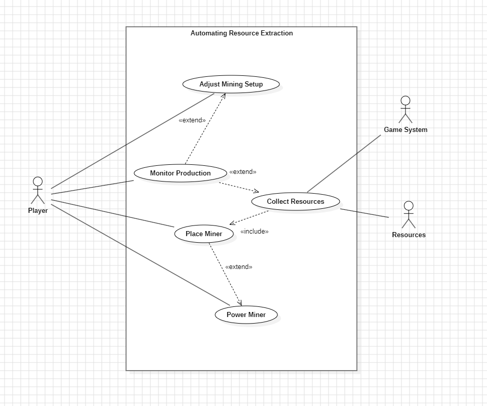

## UseCases

## Change Log
- 7/11/2025 André Narquel

Automating Resource Extraction

In this Use Case, the player automates resource extraction by placing miners on deposits, supplying them with power, 
and managing the collection of materials. The diagram highlights the interactions between the player, the game system, 
and the resources, showing how mining, energy management, and production monitoring work together to ensure a 
continuous and efficient resource flow.

----------------------------//----------------------

Primary Actor:

Player – The player who places and manages miners, ensures they have power, and monitors resource production.

Secondary Actors:

Game System – Operates the miners, collects extracted resources, updates storage, and checks energy availability.

Resources – Represent the extracted materials (e.g., copper, lead, coal) that are consumed or stored automatically.

-------------------------//-------------------------

Use Cases:

Place Miner – The player positions a miner on a resource deposit to begin extraction.

Power Miner – The player ensures the miner has energy to operate faster.

Collect Resources – The game system extracts materials from the miner and transfers them to storage automatically.

Monitor Production – The player or system tracks mining efficiency and output, identifying bottlenecks or issues.

Adjust Mining Setup – The player may move miners or modify energy allocation to optimize production.

---------------------------//-------------------------

Relationships:

Place Miner extends Power Miner – A miner can be powered to extract faster.

Collect Resources includes Place Miner – Resources can only be collected after the miner is placed.

Monitor Production extends Collect Resources – Monitoring production is optional and depends on the mining process being active.

Adjust Mining Setup extends Monitor Production – Adjustments occur when the player identifies inefficiencies during monitoring.

Use Case Diagram:

