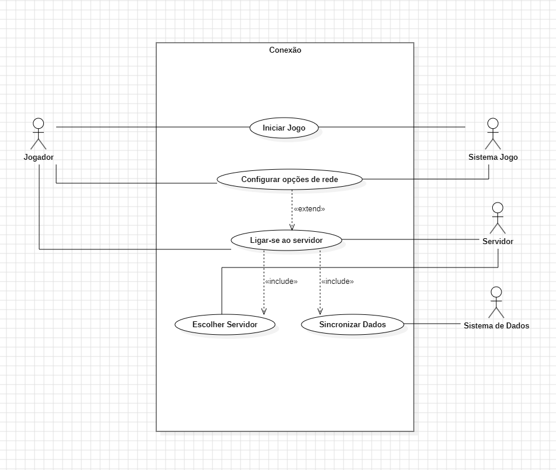

## UseCases

## Change Log
-7/11/2025 Joao Rodrigues
 

   This Use Case Diagram represents the process through which a player connects to the multiplayer system and
   synchronizes their in-game data.
   It describes the interactions between the player, the game, the server and the save system during the connection
   and data synchronization phase.
   
   Actors:
   Jogador(Primary Actor): Initiates the game and performs all connection-related actions.
   Sistema Jogo(Secondary Actor): Handles game initialization, configuration and internal operations.
   Servidor(Secondary Actor): Receives the players connection requests and exchanges gameplay data.
   Sistema de Dados(Secondary Actor): Stores and retrieves player data during synchronization.
   
   Use Cases:
   
   Iniciar jogo- the player launches the game, making the game system load initial configurations.
   Configurar opções de rede- the system applies default configurations or the player can adjust them.
   Ligar-se ao servidor- the player establishes a connection to the server.
   Escolher servidor- the player selects a multiplayer server.
   Sincronizar Dados- the player progress and data are synchronized between the local system and multiplayer server.
   
   Relationships:
   
   Ligar-se ao servidor includes Escolher servidor and Sincronizar Dados. A server must always choose a server
   before connecting and a data synchronization always happens after connection.
   
   Configurar opções de rede extends Ligar-se ao Servidor. The player may optionally adjust network options when
   selecting a server.
   
   