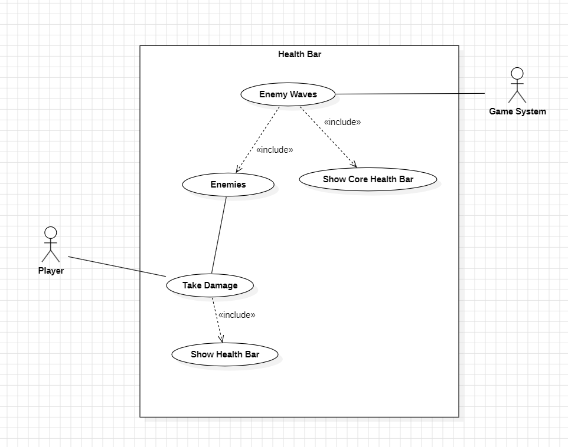

# User story 2
Health Bar
## Author(s)
Andre Narquel (67870)
Joao Fernandes (68180)
## Reviewer(s)
(*Please add the user story reviewer(s) here, one in each line, providing the authors' name and surname, along with their student number. In the reviews presented in this document, add the corresponding reviewers.*)
## User Story:
Como jogadores sentimos dificuldade em perceber o HP (Health Points) de cada Wave de inimigos, e como esse valor é alterado 
pela ação das nossas defesas.
### Review
*(Please add your user story review here)*
## Use case diagram

## Use case textual description
Este use Case representa a adição de Health Bars nas Waves Inimigas, no nosso Player e no nosso Core da base.
O Player sofre dano durante o jogo, fazendo com que a sua Health Bar apareça no ecrã e seja atualizada automaticamente.
As Enemy Waves são geradas pelo Game System, dando spawn aos inimigos que também sofrem dano durante o jogo, fazendo com que 
as suas Health Bars se tornem visíveis e sejam atualizadas automaticamente.
A Health Bar do Core aparece automaticamente no início de cada Wave e desaparece no final, independentemente do dano recebido.

#### Atores:
###### Player (Primary Actor):
- Representa o(s) Player(s) que estão a jogar.

###### Game System (Primary Actor):
- Gera automaticamente as Waves de Inimigos durante o jogo.

#### Use Cases:
- Enemy Waves - O Game System inicia uma Wave de Inimigos.
- Show Core Health Bar - A Health Bar do Core aparece no início da Wave e desaparece no final, independentemente do dano recebido.
- Enemies - Representam os Inimigos que spawnam na Wave.
- Take Damage - Representa o Player e os Inimigos sofrerem dano.
- Show Health Bar - Representa a Health Bar do Player ou dos Inimigos e aparece quando Take Damage ocorre.

#### Relações:
- Enemy Waves includes Enemies - Sempre que há Enemy Waves, Inimigos dão spawn.
- Enemy Waves includes Show Core Health Bar - Sempre que uma Enemy Wave é iniciada, a Health Bar do Core é exibida.
- Take Damage includes Show Health Bar - Sempre que algum Player ou Inimigo levam dano, a Health Bar correspondente é exibida automaticamente.
### Review
*(Please add your use case review here)*
## Implementation documentation
(*Please add the class diagram(s) illustrating your code evolution, along with a technical description of the changes made by your team. The description may include code snippets if adequate.*)
### Implementation summary
(*Summary description of the implementation.*)
#### Review
*(Please add your implementation summary review here)*
### Class diagrams
(*Class diagrams and their discussion in natural language.*)
### Review
*(Please add your class diagram review here)*
### Sequence diagrams
(*Sequence diagrams and their discussion in natural language.*)
#### Review
*(Please add your sequence diagram review here)*
## Test specifications
(*Test cases specification and pointers to their implementation, where adequate.*)
### Review
*(Please add your test specification review here)*
