# User story 3
Natural Disasters
## Author(s)
- João Rodrigues (67912)
- Tomás Silva (68725)
## Reviewer(s)
- Miguel Cordeiro 68338
## User Story:
Como jogadores achamos que as condições climáticas e eventos naturais deviam ter mais impacto no jogo, poderiam haver catástrofes naturais que interferiam diretamente com as construções dos jogadores, para tornar o jogo mais desafiante.
### Review
#### Review feita por: Miguel Cordeiro 68338
- A user story segue o formato pedido e está muito completa.
## Use case diagram

## Use case textual description
Este Use Case Diagram representa o funcionamento do sistema de Desastres Naturais implementado para o jogo Mindustry.
Os eventos — Meteor, Earthquake e Tsunami — são gerados autonomamente pelo Game System, em locais e momentos aleatórios.
As construções são afetadas de várias maneiras diferentes consoante a catástrofe em causa.
 
#### Atores:
###### Game System (Primary Actor):
- Gera automaticamente desastres naturais baseado em regras internas, ciclos temporais e probabilidades.
- Executa a lógica de cada tipo de desastre.
- Modifica o mapa e constrói os efeitos físicos nos objetos atingidos.
###### Structures (Secondary Actor)
- Representam as construções que podem ser destruídas, baralhadas ou empurradas.

#### Use Cases:
- Generate Meteor Event - O Game System ativa o Meteor Event
- Generate Tsunami Event - O Game System ativa o Tsunami Event
- Generate Earthquake Event - O Game System ativa o Earthquake Event
- Destroy Structures - As Estruturas são destruídas como efeito da catástrofe.
- Push Structures - As Estruturas são empurradas como efeito da catástrofe.
- Shuffle Structures - As Estruturas são baralhadas como efeito da catástrofe.
#### Relações:
- Generate Meteor Event includes Destroy Structures - O Generate Meteor Event inclui sempre a destruição de estruturas (Destroy Structures).
- Generate Tsunami Event includes Pushes Structures - O Generate Tsunami Event inclui sempre o empurrão de estruturas (Push Structures).
- Generate Earthquake Event includes Shuffles Structures - O Generate Earthquake Event inclui sempre a embaralhar de estruturas (Shuffle Structures).
- Destroy Structures extends Generate Tsunami Event - O Generate Tsunami Event poderá causar a destruição de estruturas (Destroy Structures).
- Destroy Structures extends Generate Earthquake Event - O Generate Earthquake Event poderá causar a destruição de estruturas (Destroy Structures).
### Review
*(Please add your use case review here)*
## Implementation documentation
(*Please add the class diagram(s) illustrating your code evolution, along with a technical description of the changes made by your team. The description may include code snippets if adequate.*)
### Implementation summary

#### 1.Abstract Disaster (NaturalDisasterSpawner.java)
- Introduz uma classe abstracta responsável por definir o comportamento comum a todos os desastres naturais adicionados
ao jogo.
- Funciona como um template, garantindo que cada desastre implementa métodos essencias como o update(), sheduleNext(), 
triggerEvent() e armazena propriedades genéricas como o timer e o nextEvent. Esta abstração permite adicionar desastres
no futuro apenas herdando a classe e implementando os seus métodos.

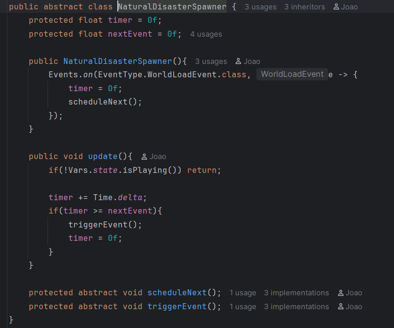

#### 2.Meteor Events (MeteorSpawner.java)
- MeteorSpawner é uma implementação concreta do sistema de desastres naturais, herdando de NaturalDisasterSpawner.
- O objetivo desta classe é gerar eventos periódicos de meteoros no mapa durante o jogo, criando meteoros em posições 
aleatórias que causam dano em área.

- A classe define o intervalo entre meteoros através do método:

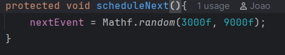

- Quando o temporizador expira, o triggerEvent() é chamado:

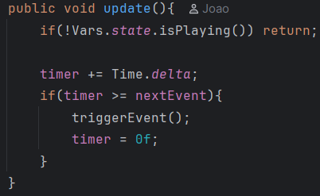

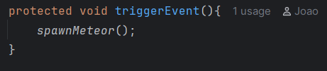

- O método spawnMeteor controla toda a lógica de criação de meteoros no mapa. 
  - Principais passos:
     - Confirma se o jogo está ativo (Vars.state.isPlaying()).
     - Determina um número aleatório entre 4 e 7 meteoros a gerar.
     - Gera posições válidas via generateValidPositions() (máx. 100 tentativas). 
     - Para cada meteoro:
         - Obtém uma posição random válida.
         - Calculates:
            - raio da explosão (20–60)
            - dano total (rad * 10)
            - Lança o efeito visual Fx.meteorFall.
         - Após 90 ticks:
             - Executa a explosão (Fx.explosion),
             - Aplica dano em área (Damage.damage),
             - Emite o evento público MeteorEvent

- O método generateValidPositions() gera posições válidas para os meteoros cairem usando o método isNearCore(), para 
assegurar que não acertam na core, para não prejudicar o jogador de forma injusta.

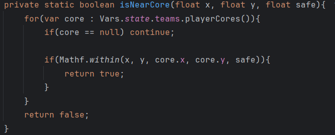

#### 3. Earthquake Event (EarthquakeSpawner.java)
- EarthquakeSpawner é uma implementação concreta do sistema de desastres naturais, herdando de NaturalDisasterSpawner.
- A classe é responsável por:
 - escolher aleatoriamente um ponto do mapa como epicentro
 - aplicar efeitos visuais
 - deslocar estruturas dentro da área afetada
 - destruir estruturas que não conseguem ser reposicionadas

- Tal como os outros spawners, define um intervalo de tempo entre eventos com o método sheduleNext() e quando o tempo 
expira dá trigger ao evento triggerEvent().

- O método spawnEarthquake() é responsável pela lógica do evento, desde escolher um ponto, aplicar efeitos visuais e 
aplicar os métodos responsáveis à deslocação de estruturas e à sua destruição no caso em que é impossível voltar a colocar
a estrutura. Ele começa com a seleção do epicentro:

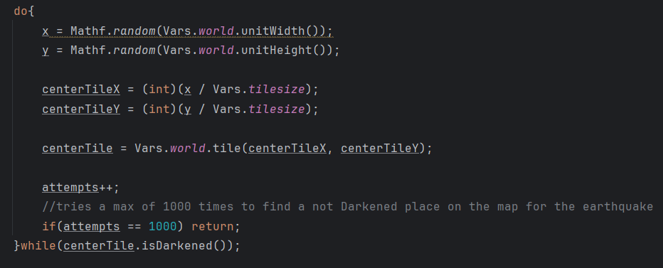

-Depois o raio do terramoto é gerado aleatoriamente e o ecrã treme proporcionalmente:

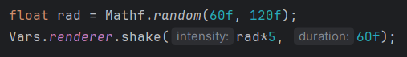

- O método replaceCalculationAndAnimation() é chamado e identifica os tiles e estruturas dentro do raio, guarda a lista
de todos os tiles possíveis para recolocação e desenha as animações. A seguir no spawnEarthquake() as posições dos tiles
possíveis para recolocação são baralhados, remove-se as estruturas dentro da área do terramoto com o método 
removeAffectedBuildings() e volta-se a colocá-las nas suas novas posições com o método replaceAffectedBuildings(), se 
a sua nova posição nao for válida a construção é destruída.

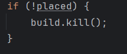

- No final o evento é emitido.

#### 4. Tsunami Event (TsunamiSpawner.java)
- TsunamiSpawner é uma implementação concreta do sistema de desastres naturais, herdando de NaturalDisasterSpawner.
- É responsável por implementar a lógica para a criação e propagação de um tsunami no mundo do jogo.
- Tal como os outros spawners, define um intervalo de tempo entre eventos com o método sheduleNext() e quando o tempo
expira dá trigger ao evento triggerEvent().

- O método spawnTsunami() escolhe uma posição aleatória no mapa que seja válida para o tsunami ser gerado, determina a 
sua direção(usando um vetor de 8 posições), força do tsunami(tsunamiFactor) e tipo de onda(água ou lava). Se o tile 
inicial for válido, inicia-se o processo do tsunami.

- Primeiro determina-se as estruturas que vão ser afetadas pelo tsunami com o método calculateAffectedBuildings(), que
regista as estruturas afetadas, calcula e guarda as novas posições das estruturas. Depois é realizada a animação com o
método animation(). A seguir remove-se as estruturas afetadas com o método removeAffectedBuildings() e aqui é importante
garantir que o core se estiver na lista das estruturas afetadas será removido dessa lista com o método removeCoreFromAffectedBuildings(), 
pois o core não pode ser afetado dado que se for o jogo acaba injustamente para o jogador.

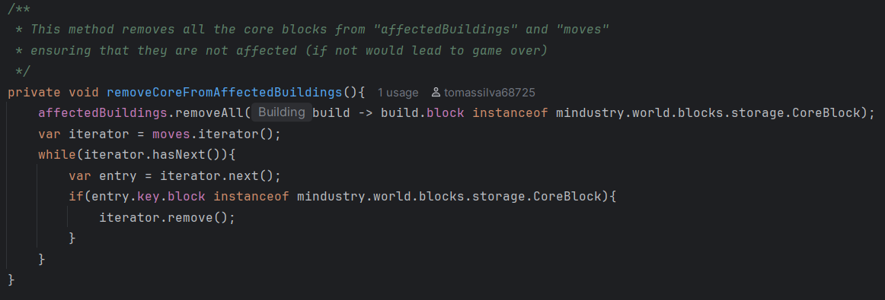

- No final volta-se a colocar as estruturas nas suas novas posições caso seja possível, senão destrói as estruturas e o
evento é emitido.

#### Eventos (EventType.java)
- A classe EventType já existia como parte do código-base do Mindustry e define diversos eventos usados internamente 
pelo motor do jogo. Para suportar o novo sistema de desastres naturais criado pela equipa, foram adicionadas três novas 
classes de eventos:
 - MeteorEvent
 - EarthquakeEvent
 - TsunamiEvent
- Cada uma destas classes representa um tipo de notificação emitida pelo respetivo spawner, permitindo que outros 
subsistemas do jogo reajam quando um desastre é desencadeado.

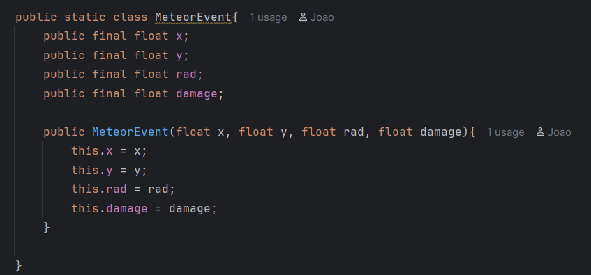

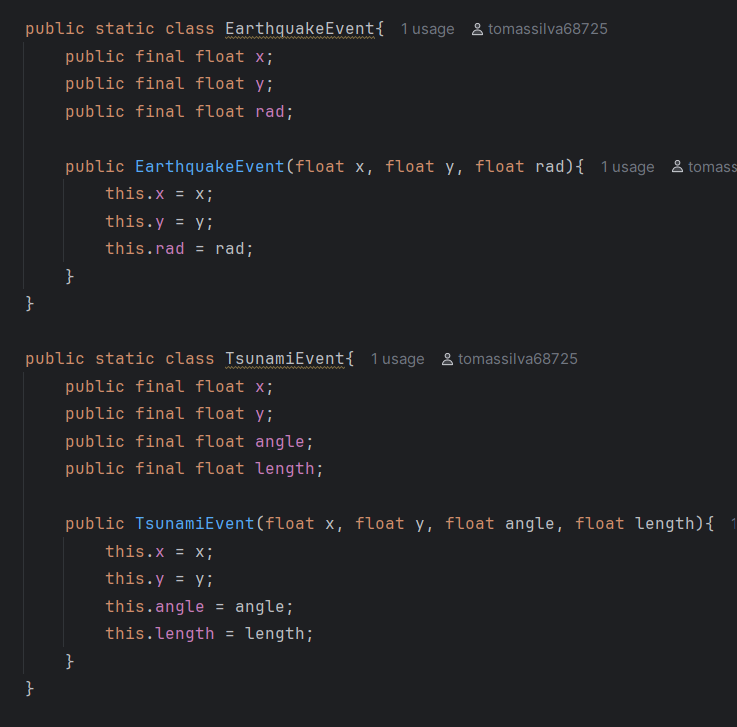

#### Efeitos (Fx.java)
- A classe Fx já fazia parte do código original do Mindustry e continha diversos efeitos visuais utilizados no jogo. 
No contexto da implementação dos novos desastres naturais, foram adicionados novos efeitos gráficos específicos para
representar visualmente cada evento.
- Os efeitos adicionados foram:
 - meteorFall — Representa a queda visual do meteoro desde fora do mapa até ao ponto de impacto.
 - earthquake1 e earthquake2 — Duas variantes de efeitos de oscilação no terreno para criar a sensação visual de tremor.
 - waterTsunami — Animações para ondas de tsunami de água conforme esta se desloca pela área afetada.
 - lavaTsunami — Variante do tsunami, mas com textura e cor adaptada para lava.

- Estes efeitos são ativados pelos respetivos Spawners (MeteorSpawner, EarthquakeSpawner e TsunamiSpawner) no momento 
em que o desastre ocorre.

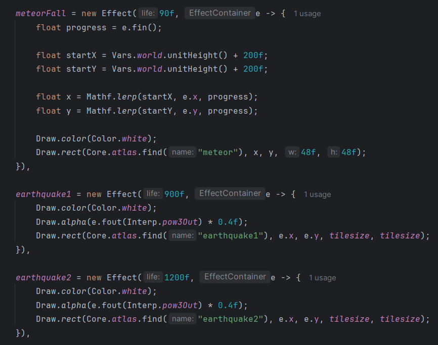

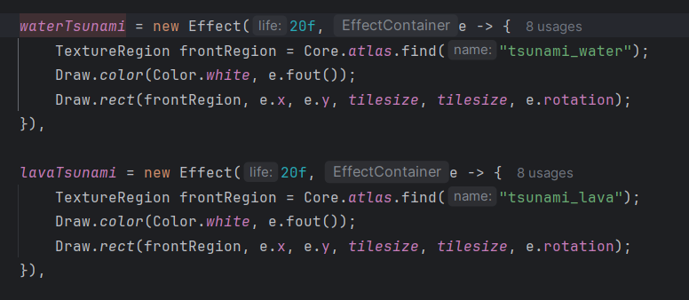

#### Game update (Logic.java)
- A classe Logic contém o ciclo principal de atualização do jogo (update()), responsável por processar todos os eventos,
físicas, entidades e regras de jogo a cada frame. Para integrar os novos desastres naturais no funcionamento normal da 
partida, foram adicionadas chamadas específicas dentro deste ciclo. No interior do método update(), após a atualização 
do estado do jogo e antes da conclusão do frame, foi introduzida a invocação dos métodos de atualização dos três novos 
sistemas de desastres:
 - meteorSpawner.update()
 - earthquakeSpawner.update()
 - tsunamiSpawner.update()

- Estas chamadas garantem que as classes são atualizadas a cada frame.

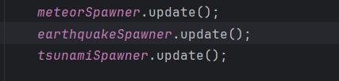

#### Integração dos Natural Disaster (Vars.java)

- A classe Vars é responsável por manter referências globais a sistemas centrais do jogo (entidades, spawners, assets, 
controladores, renderizadores, etc.). Para integrar os novos desastres naturais no ecossistema do jogo, foram adicionadas 
três variáveis globais:
 - public static MeteorSpawner meteorSpawner;
 - public static EarthquakeSpawner earthquakeSpawner;
 - public static TsunamiSpawner tsunamiSpawner;

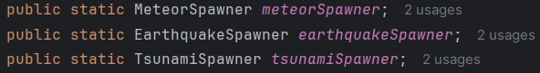

- Estas variáveis permitem que outras partes do jogo — como o ciclo de atualização (Logic.update()) ou sistemas de 
rendering e efeitos consigam aceder diretamente aos spawners dos novos desastres. Durante a inicialização do jogo, os 
spawners são criados:
 - meteorSpawner = new MeteorSpawner();
 - earthquakeSpawner = new EarthquakeSpawner();
 - tsunamiSpawner = new TsunamiSpawner();

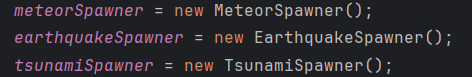

- Assim, a classe Vars passa a funcionar como um ponto central de acesso para todos os novos sistemas de desastres 
introduzidos no projeto.

#### Adição de Assets Gráficos (assets.raw)
- Para suportar visualmente os novos desastres naturais, foram adicionados ficheiros .png na pasta assets-raw do 
Mindustry, que posteriormente são processados e incluídos no atlas do jogo. Estes recursos são utilizados pelas novas 
Effects definidas em Fx.java.
- Os seguintes sprites foram incluídos em assets-raw/sprites/ (ou no subdiretório correspondente):
 - meteor.png — sprite usado no efeito meteorFall
 - earthquake1.png — textura usada no efeito earthquake1
 - earthquake2.png — textura usada no efeito earthquake2
 - tsunami_water.png — sprite da onda de tsunami com água
 - tsunami_lava.png — sprite da onda de tsunami com lava

#### Review
#### Review feita por: Miguel Cordeiro 68338
- O resumo da implementação está extremamente bem feito e é acompanhado por screenshoots para um melhor entendimento da implementação
### Class diagrams
- No primeiro diagrama está representado a estrutura do código na primeira fase com apenas um desastre natural, a queda de
de meteoros. A classe MeteorSpawner é instanciada uma vez pela classe Vars, usa o atributo meteorFall da classe Fx, cria
um meteorEvent e é chamada pela classe Logic no método update.

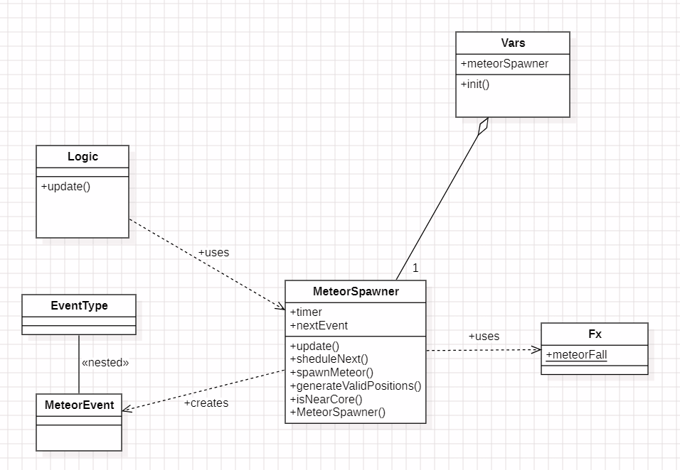

- Na segunda fase em vez de termos apenas um desastre natural temos a queda de meteoros, o terramoto e o tsunami, cada um
a ser usado e a usar as outras classes da mesma maneira, apesar de terem bastantes aspetos em comum.

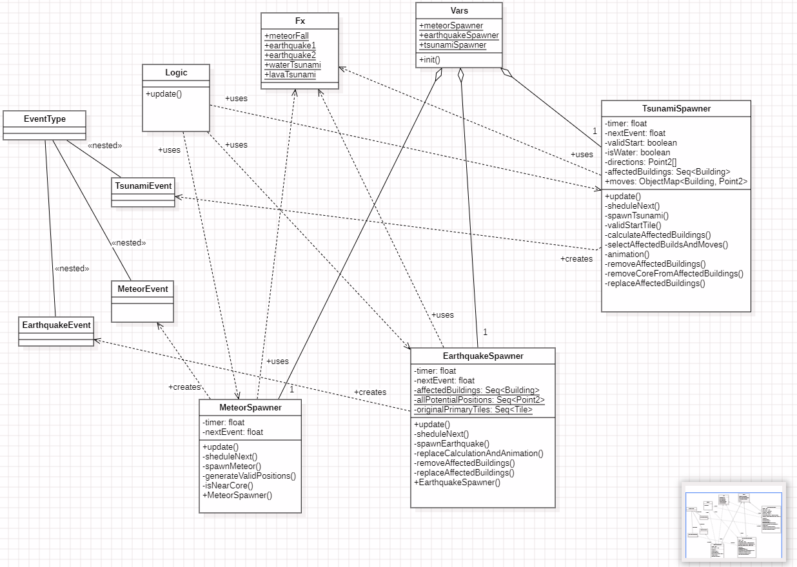

- Na fase final foi criado uma classe abstrata NaturalDisasterSpawner om o objetivo de unificar e generalizar o 
comportamento comum entre todos os desastres naturais introduzidos no projeto. Até este ponto, cada spawner (Meteor, 
Earthquake e Tsunami) possuía a sua própria implementação de lógica de temporização, atualização e triggering de 
eventos, o que conduzia a duplicação de código e a um elevado acoplamento entre classes.
- A criação desta classe abstrata:
 - removeu duplicação de código;
 - clarificou a arquitetura dos desastres naturais;
 - tornou a manutenção mais fácil;
 - criou uma hierarquia limpa e consistente;
 - melhorou a legibilidade do diagrama UML final. 

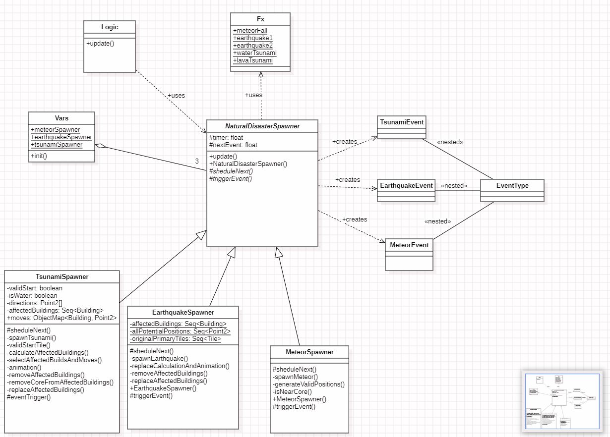
### Review
*(Please add your class diagram review here)*
### Sequence diagrams

- O processo inicia-se com o Logic a invocar o update da classe abstrata, que verifica se o temporizador expirou e, 
em caso afirmativo, passa a execução ao MeteorSpawner. Este começa por calcular posições seguras através de um ciclo de 
validação para garantir que não atinge o Core e, de seguida, itera sobre 4 a 7 meteoros iniciando o efeito visual de queda. 
Para cada meteoro é agendada uma tarefa diferida de 90 ticks que, ao terminar, executa simultaneamente a animação da 
explosão e a notificação do evento global, finalizando com o reinício do temporizador na classe base.

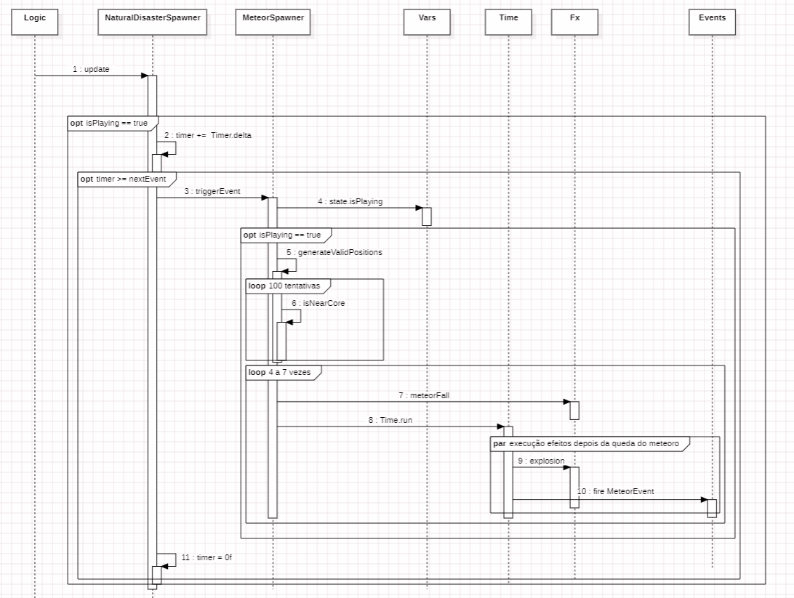

#### Review
*(Please add your sequence diagram review here)*
## Test specifications

### Test 1: Meteor Spawn Safety Zone
###### Goal:
- Garantir que meteoros nunca caem demasiado próximos do core, respeitando o safeRadius definido na implementação.

###### Steps:
- Iniciar qualquer mapa com pelo menos 1 Core.
- Jogar até um meteoro cair naturalmente.
- Enquanto ocorrem quedas de meteoros:
- Colocar várias marcas (ex.: ping) onde os meteoros caem.
- Medir a distância entre o local de impacto e o Core mais próximo.

###### Expected Result:
- Nenhum meteoro deve cair dentro do raio de segurança (80 unidades, aproximadamente 8 tiles).
- Todos os impactos devem ocorrer fora da zona protegida em torno dos cores.

### Test 2: Meteor Damage Integrity Test
###### Goal:
- Garantir que meteoros causam dano real no raio esperado e destroem edifícios afetados.

###### Steps:
- Colocar vários edifícios fracos espalhados pelo mapa.
- Esperar pela queda de meteoros.
- Observar os edifícios atingidos.
- Verificar o seu estado após o evento.

###### Expected Result:
- Edifícios dentro do raio do meteoro são destruídos consistentemente.
- Edifícios fora do raio permanecem intactos.

### Test 3: Earthquake Shuffle Stability Test
###### Goal:
- Garantir que o terramoto recoloca edifícios dentro do raio, mas não causa softlock nem posicionamentos inválidos.

###### Steps:
- Criar uma zona com muitos edifícios juntos (ex.: várias fábricas).
- Permitir que ocorra um terramoto natural.
- Após o terramoto observar edifícios recolocados.
- Verificar que não aparecem em cima uns dos outros nem em posições invalidas (ex.:minerador em zona sem minério,etc...).
- Confirmar que edifícios fora da área não se moveram.

###### Expected Result:
- Todos os edifícios dentro do raio do terramoto são deslocados para tiles válidos.
- Nenhum edifício sobrepõe outro.
- Edifícios fora da área não mudam de posição.
- O jogo continua sem erros.

### Test 4: Earthquake Core Protection Test
###### Goal:
- Garantir que o terramoto não remove nem move Core Blocks, conforme a lógica da implementação.

###### Steps:
- Iniciar um mapa com um Core simples.
- Colocar edifícios à volta para confirmar movimentação.
- Esperar por um terramoto.
- Após a animação verificar se o Core permaneceu no local original.

###### Expected Result:
- O Core nunca deve desaparecer, ser movido ou ser destruído.

### Test 5: Tsunami Direction Consistency
###### Goal:
- Verificar que o tsunami se move sempre na direção calculada (0°, 45°, 90°, …), de acordo com o índice da array directions.

###### Steps:
- Iniciar mapa com água ou lava suficiente para permitir um tsunami.
- Quando um tsunami começar:
- Observar a direção da onda.
- Comparar com Point2[] directions (ex.: 0° = (0,1), 90° = (-1,0)…).

###### Expected Result:
- A onda move-se exatamente na mesma direção definida no código.
- A animação acompanha essa direção.

### Test 6: Tsunami Water vs Lava Detection
###### Goal:
- Garantir que o sistema distingue corretamente entre tsunami de água e tsunami de lava.

###### Steps:
- Encontrar área com um tamanho conciderável cheia de líquido.
- Esperar tsunami observar o efeito (Fx.waterTsunami).
- Verificar se a cor do efeito condiz com a do líquido em que ocorreu.

###### Expected Result:
- Em água usa efeito de água.
- Em lava usa efeito de lava.

### Review
*(Please add your test specification review here)*
