# User story 3
Trading System
## Author(s)
- André Narquel (67870)
- João Fernandes (68180)
## Reviewer(s)
- Miguel Cordeiro 68338
- Ricardo Pote 68245
- Tomás Silva 68725
- João Rodrigues 67912

## User Story:
Como jogador quero uma forma de utilizar os minerais que perdem utilidade ao longo do jogo e que por consequência são excessivamente acumulados, para
apresentarem alguma utilidade em qualquer fase do jogo.
### Review
#### Review feita por: Miguel Cordeiro 68338
- A user story está bem feita, consoante o formato pedido e foi uma boa ideia criar outra user story pois a user story 2 era algo mais simples.
## Use case diagram

## Use case textual description
Este Use Case representa o funcionamento do Trading System implementado. O Player interage com o Trader,que apresenta 
opções aleatórias de trade de minerais. O Player pode selecionar uma das opções ou decidir não trocar nada.
Cada Trade selecionada é validada pelo Game System, que verifica se o Player possui os recursos necessários e, em caso afirmativo, realiza a troca.
O Player pode realizar até cinco trades, após a quinta trade ou após 10 minutos, as opções de trade são automaticamente resetadas e novas opções são apresentadas.

#### Atores:
###### Player (Primary Actor):
- Interage com o Trader e seleciona uma das opções de trade disponíveis.

###### Game System (Primary Actor):
- Gera as opções de trade aleatórias.
- Valida as Trades selecionadas pelo Player.
- Controla o número de trades feitas e o timer de 10 minutos, resetando as opções quando necessário.

#### Use Cases:
- Trader Interaction – O Player inicia a interação com o Trader.
- Show Trade Options – O Game System apresenta cinco opções de trade aleatórias.
- Select Trade – O Player seleciona uma das opções de trade.
- Validate Trade – O Game System verifica se a trade selecionada é válida, ou seja, se tem recursos suficientes.
- Execute Trade – O Game System realiza a troca de recursos entre Player e Trader.
- Number of Uses – O Game System controla o número de Trades realizadas pelo Player.
- Timer – O Game System controla o tempo decorrido até o reset automático das Trades.
- Reset Trades – O Game System reseta as opções de Trade, seja por ter realizado 5 trades ou por timer de 10 minutos.

#### Relações:
- Trader Interaction includes Show Trade Options – Sempre que o Player interage com o Trader, as cinco opções de trade são apresentadas.
- Show Trade Options includes Select Trade – O Player pode então selecionar uma das opções disponíveis.
- Select Trade includes Validate Trade – Todas as Trades selecionadas pelo Player são validadaa pelo Game System.
- Validate Trade includes Execute Trade – Se a trade for válida, a troca é executada.
- Execute Trade includes Number of Uses – Após a troca ser executada, o contador de trades é atualizado.
- Number of Uses extends Reset Trades – Quando o Player realiza cinco Trades, as opções são resetadas.
- Timer extends Reset Trades – Quando passam 10 minutos, as opções de trade são resetadas automaticamente.
### Review (Tomás Silva 68725)
O Use Case Diagram (mais descrição) explica claramente como funciona o Trading System no jogo.
Os actors e as suas responsabilidades estão identificados.
Cada use case tem uma definição coerente.
As relações include e extend estão bem representadas e fazem sentido com o diagrama.
Por fim, os gatilhos de reset (5 trades ou 10 minutos) estão bem explicados.
## Implementation documentation
(*Please add the class diagram(s) illustrating your code evolution, along with a technical description of the changes made by your team. The description may include code snippets if adequate.*)
### Implementation summary

#### TradingSystem
É um Singleton responsável por gerir todo o sistema de trocas do Trader
Tem 3 constantes que são:
- MAX_OFFERS = 5 - é o número de ofertas que o Trader oferece de cada vez.
- MAX_TRADES_DONE = 5 - é o número de trocas já realizadas que acionam o
  refresh das 5 trocas possiveis do Trader.
- REFRESH_INTERVAL = 36000f - tempo que leva ao Trader a dar refresh automático
  das suas ofertas (10 minutos).

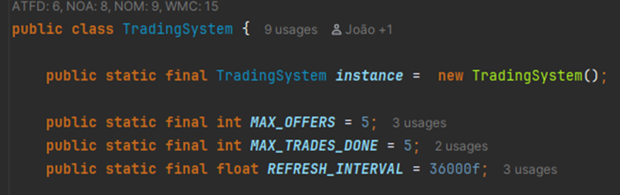

Esta classe também guarda um array de TradeOffers
Apresenta uma ligação ao TradingDialog (representa a UI) através da inicialização de um dialog
dentro do construtor do TradingSystem.

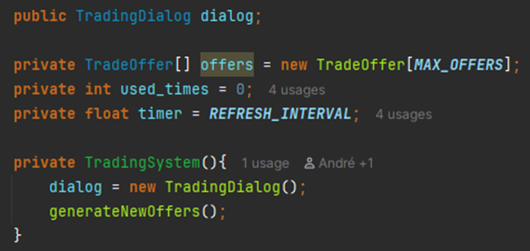

generateNewOffers()
substitui as ofertas atuais por novas ofertas aleatórias e da reset aos valores
de trades feitas neste refresh (used_times) e timer.

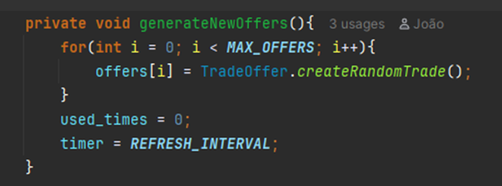

update()
reduz o valor do timer e quando o timer chega a 0 chama generateNewOffers().

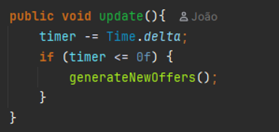

canTrade() e executeTrade()
canTrade verifica se o core do player tem itens suficientes para a trade e o
executeTrade() realiza a troca (retira os itens ao core e adiciona o que o trader
tinha estipulado na troca).

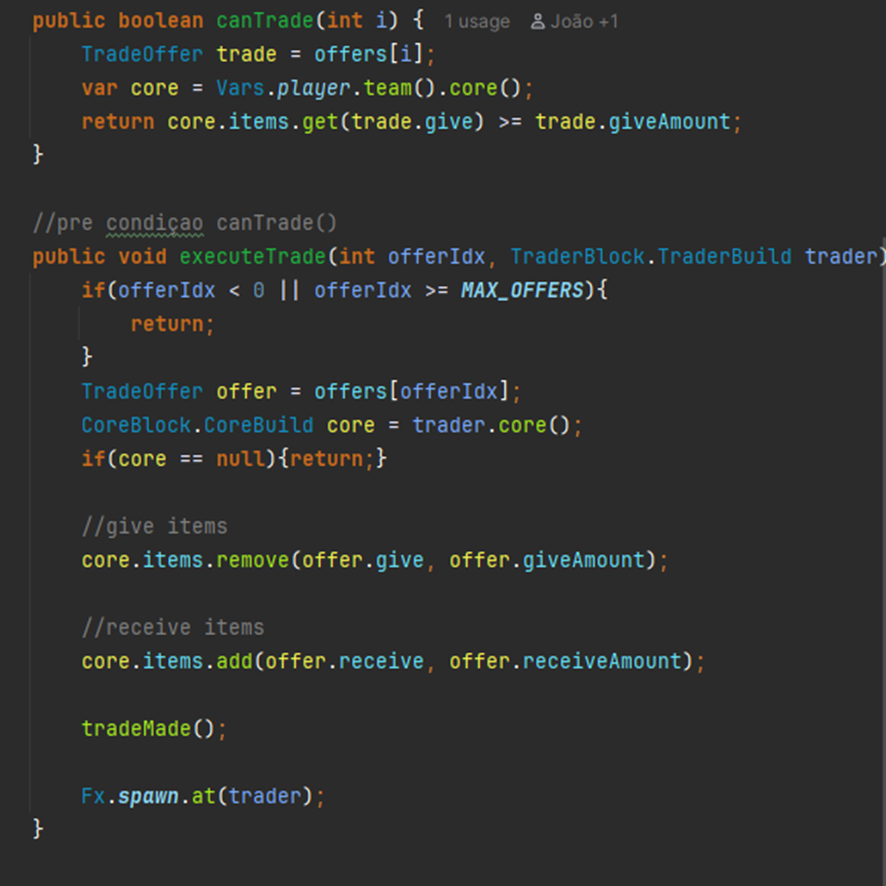

getTimeRemaining() - tempo restante ate ao refresh.
getUsedTimes() - quantas trocas ja foram feitas desde o ultimo refresh.
getOffers() - devolve o array de ofertas.

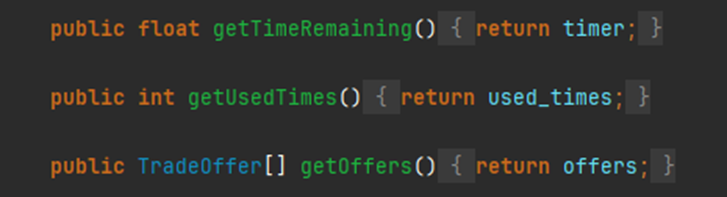

#### TradeOffer
Representa uma Troca no sistema de trading
define o item a dar, item a receber, e respetivas quantidades.

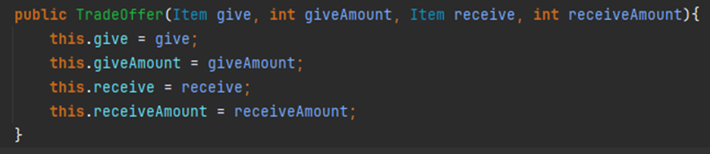

o createRandomTrade cria trocas com equilibrio da seguinte forma
escolhe 2 itens aleatórios, obtém a raridade de cada um com base no enum
que será explicado em alguns parágrafos (ItemRarity).

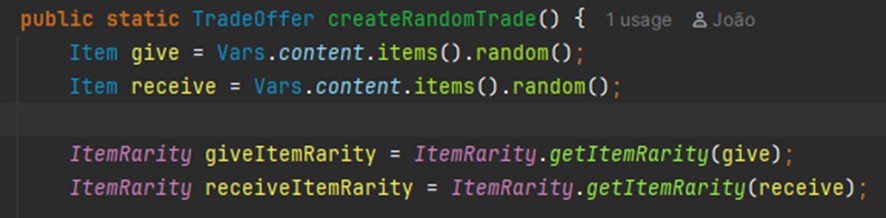

garante que os itens sao diferentes e que ambos tem raridade definida e que
é possivel fazer trocas entre as 2 raridades(verificado no tradePossible()
do ItemRarity).

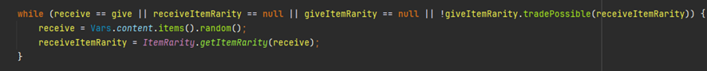

gera uma quantidade de 100 a 200 e calcula a quantidade que vai ser recebida
com base na raridade dos 2, o tal valor 100-200 e um valor random de -10 a 10.

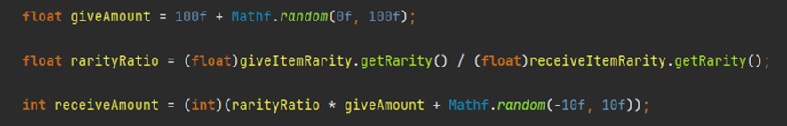

retorna uma TradeOffer com os valores calculados.

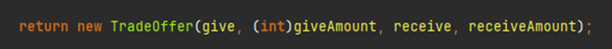

#### ItemRarity
É um enum que classifica todos os itens numa escala de raridade de 1 a 5.

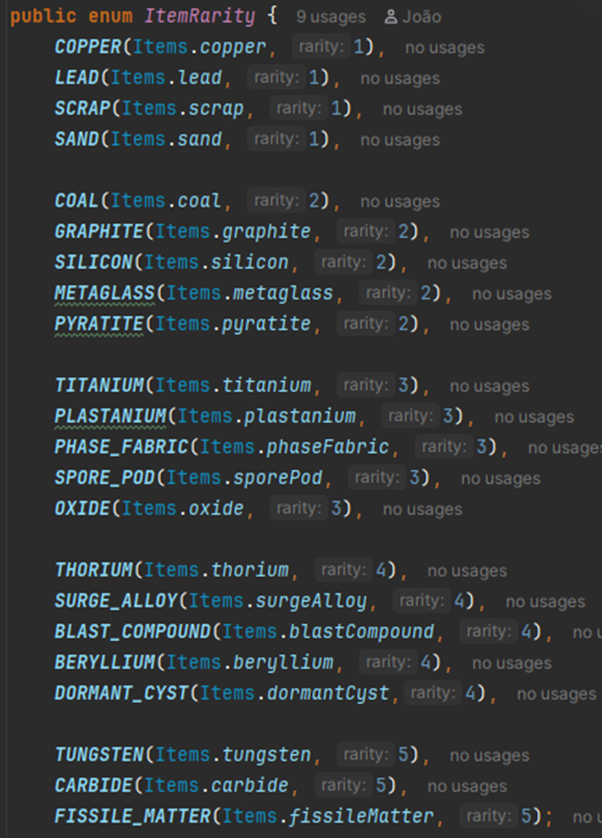

o método mais relevante é o tradePossible() (já mencionado anteriormente)
que verifica se uma troca é possivel entre 2 raridades - um item só pode
ser trocado por outro cuja raridade não exceda em mais de 2 níveis a
raridade do item oferecido. (para evitar stepUps que sejam "absurdos").

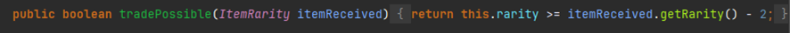

getItemRarity() - serve para converter um Item na sua ItemRarity.

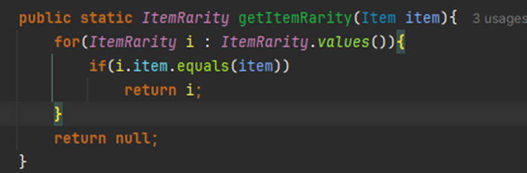

#### TraderBlock e Blocks
Define o bloco “Tim Cheese”: um bloco com lado 2, sólido, sempre ativo,
configurável, sincronizado e sem sombra. Pertence à categoria effect,
é indestrutível, fica oculto no menu e mostra nos stats o cooldown do
sistema de trocas.

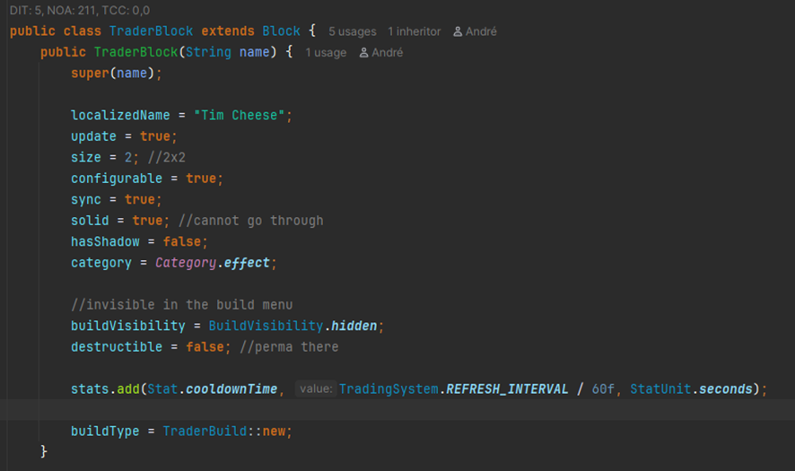

A build interna, TraderBuild, mantém ligação ao TradingSystem.instance,
atualiza-o a cada tick e, quando o jogador toca no bloco correto e existe
um core aliado, abre o Trading Dialog.

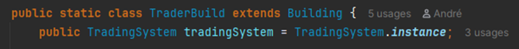
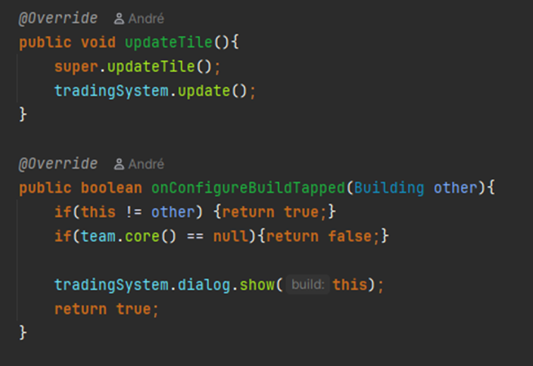

No Blocks class, este bloco é registado como oculto, sem custos de construção
e indestrutível, reforçando que o “Tim Cheese” é um bloco fixo e permanente no mapa.

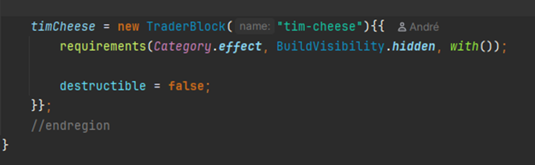

#### TradingDialog e UI
O TradingDialog é a interface do bloco “Tim Cheese” que mostra
as ofertas de troca do jogador. Ele exibe a imagem do bloco no
topo e uma tabela centralizada com os itens a dar e receber,
incluindo um botão para executar cada troca. 

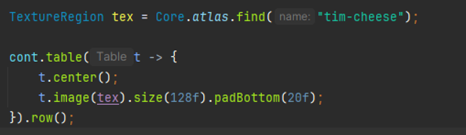
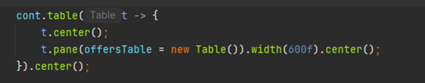
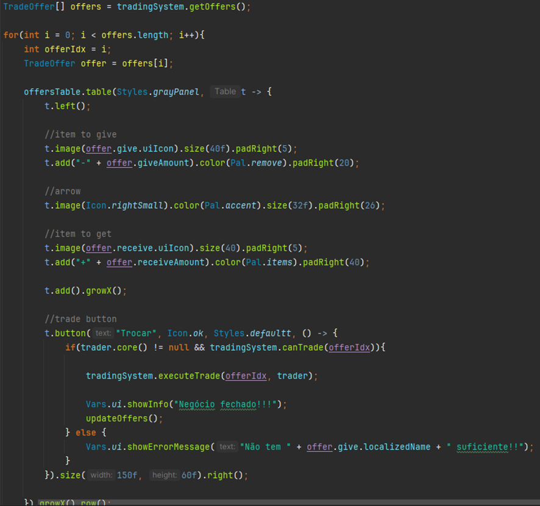

O Dialog atualiza automaticamente as ofertas ao fim de 10 min ou
das 5 trades, verifica se o jogador tem recursos suficientes e mostra 
mensagens de sucesso ou erro. 

Exibe também o tempo até o próximo refresh e o número de
trocas restantes. Ele conecta se diretamente ao TradingSystem do
TraderBuild, garantindo que o estado das ofertas esteja sempre
sincronizado com a lógica do jogo.

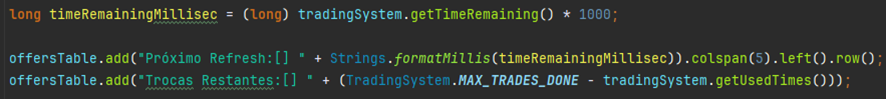

É instanciado e inicializado no UI.java que suporta o resto dos
Dialogs e elementos de UI do jogo.

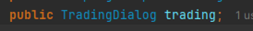
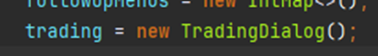

#### FileMapGenerator
O método injectTraderBlock procura o core de uma equipa e
calcula uma posição relativa (abaixo e levemente à esquerda).
Se o core e o bloco Tim Cheese existirem, obtém o tile de destino.
Por fim, coloca o bloco Tim Cheese nesse tile atribuindo-o à equipa.

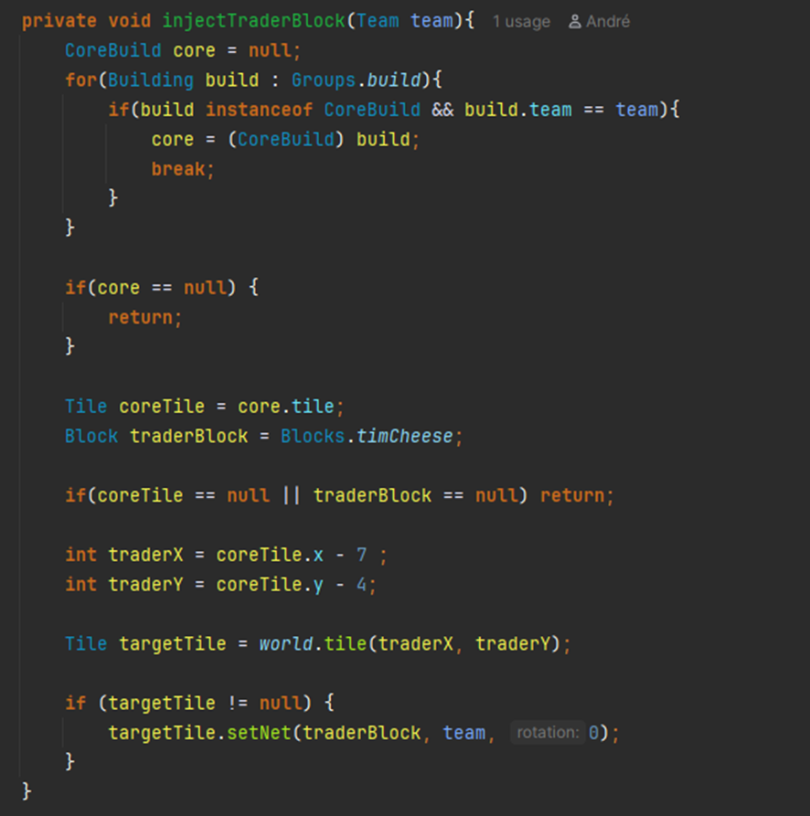
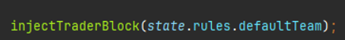

#### Review
#### Review feita por: Miguel Cordeiro 68338
- O resumo da implementação está extremamente bem feito e é acompanhado por screenshoots para um melhor entendimento da implementação.
### Class diagrams

O diagrama representa o TradingSystem como o núcleo do sistema de trocas: é um singleton que gere TradeOffers,
usando o ItemRarity para validar e equilibrar cada troca.
O TraderBlock e a sua TraderBuild integram este sistema no mundo do jogo, atualizando-o a cada tick e abrindo o 
TradingDialog quando o jogador interage com o bloco. O TradingDialog apresenta as ofertas ao jogador e comunica 
diretamente com o TradingSystem, enquanto FileMapGenerator e Blocks apenas tratam da colocação e registo do bloco 
Trader (Tim Cheese) no mapa.

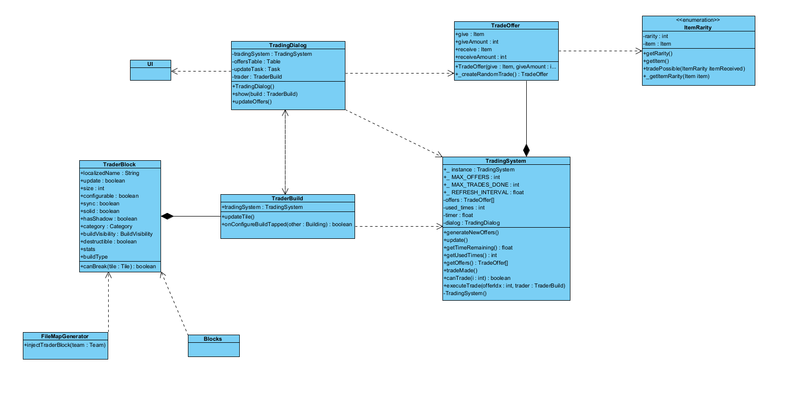
### Review Ricardo Pote 68245
A ideia geral e o fluxo de interação estão muito bons e fáceis de perceber ao olhar para este diagrama possivelmente algo a acrescentar seria os quantificadores para que seja mais claro ainda como as interações entre classes estão definidas.
### Sequence diagrams

O diagrama mostra o fluxo de trading: O TraderBlock é colocado no FileMapGenerator , quando o bloco é clicado abre o 
TradingDialog, visualiza as ofertas (TradeOffer) fornecidas pelo TradingSystem, executa uma troca se possível (fazendo 
as trocas de itens com o core) , e o sistema atualiza o timer e gera novas ofertas quando as 5 definidas são utilizadas 
ou quando o timer chega ao fim.

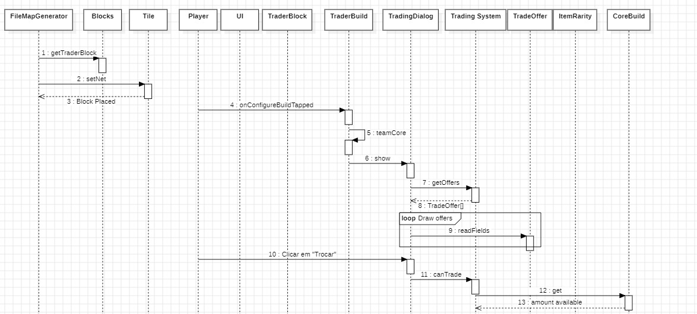
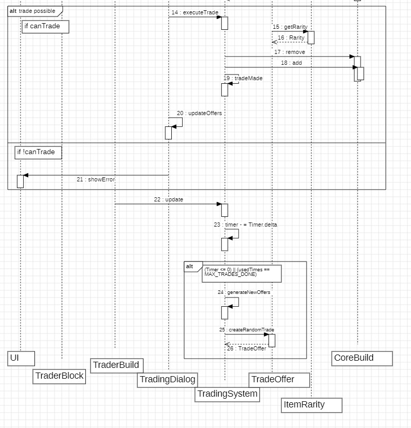
#### Review
O fluxo de trading é bem detalhado, cobrindo a colocação do bloco, a visualização das ofertas, e a execução condicional 
da troca. Há uma lógica clara para a gestão de ofertas através de um timer e um limite de trocas (MAX_TRADES_DONE). A 
interação entre os componentes como TradingSystem e CoreBuild para gestão de itens e ofertas é explícita.
## Test specifications
### Test 1: Trade bem sucedida
###### Goal:
- Garantir que o Core ganhe e perca os itens certos aquando de uma troca bem sucedida. 

###### Steps:
- Iniciar qualquer mapa da campanha.
- Jogar até ter itens suficientes para uma das trades do Trader.
- Clicar no Trader.
- Selecionar a troca desejada.
- Verificar se houve uma mensagem de sucesso e se os itens corretos foram retirados e adicionados ao Core.

###### Expected Result:
- Os itens corretos foram retirados e adicionados ao Core. 

### Test 2: Trade mal sucedida
###### Goal:
- Garantir que os itens do Core não sofram alterações numa troca aquando de uma troca que não funcione.

###### Steps:
- Iniciar qualquer mapa da campanha.
- Clicar no Trader.
- Selecionar a troca desejada.
- Verificar se houve uma mensagem de erro e se houveram alterações aos itens do Core.

###### Expected Result:
- Os itens no Core mantém-se inalterados e aparece uma mensagem de erro.

### Test 3: Timer chegou ao fim
###### Goal:
- Garantir que quando o timer chega ao fim as trocas disponiveis são geradas de novo, o timer sofre reset e as trocas
- restantes passam a ser outra vez 5

###### Steps:
- Iniciar qualquer mapa da campanha.
- Clicar no Trader.
- Esperar que os 10 minutos do Timer passem.
- Verificar as possíveis alterações nas trocas, timer e número de trocas restantes.

###### Expected Result:
- As trocas disponiveis serão geradas de novo, o timer sofrerá sofre reset e as trocas
- restantes passarão a ser outra vez 5.

### Test 4: Trocas restantes esgotadas
###### Goal:
- Garantir que as trades disponíveis são geradas outra vez quando o player troca 5 vezes com o Trader em apenas 1 refresh.

###### Steps:
- Iniciar qualquer mapa da campanha.
- jogar normalmente para ter itens para troca.
- Clicar no Trader.
- Trocar 5 vezes bem sucedidas.
- Verificar as possíveis alterações nas trocas, timer e número de trocas restantes.

###### Expected Result:
- As trocas disponiveis serão geradas de novo, o timer sofrerá sofre reset e as trocas
- restantes passarão a ser outra vez 5.

### Test 5: Verificar o Sprite do TraderBlock
###### Goal:
- Garantir que o sprite foi bem carregado para o TraderBlock

###### Steps:
- Iniciar qualquer mapa da campanha
- Verificar qual o aspeto do bloco situado em baixo e levemente à esquerda do Core.

###### Expected Result:
- O bloco será um Rato

### Review (Tomás Silva 68725)
Cada teste tem Goal, Steps e Expected Result, o que é excelente e os testes cobrem todos os casos essenciais do 
Trading System: sucesso, falha, timer, limite de trocas, e até o sprite do bloco.