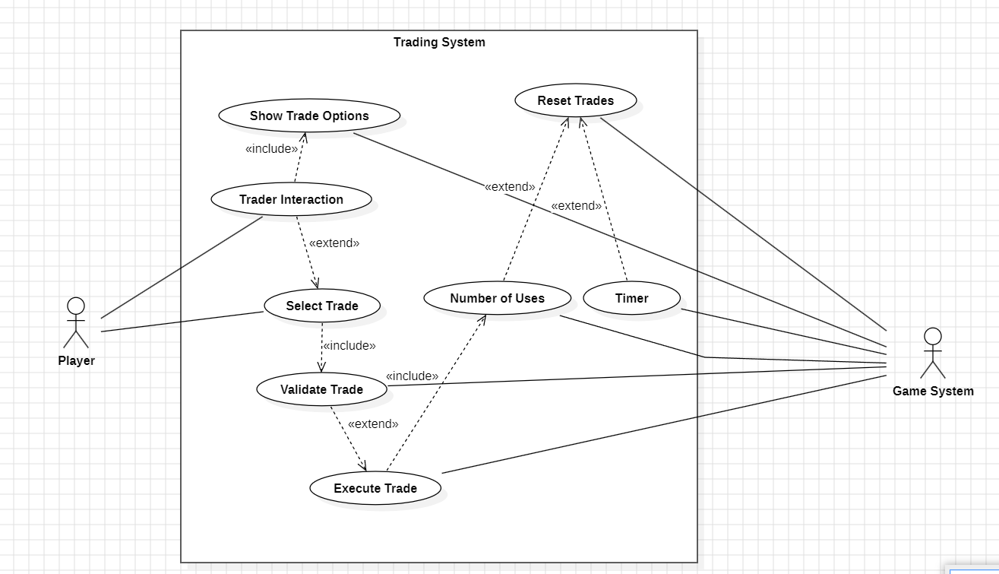

# User story 3
Trading System
## Author(s)
- André Narquel (67870)
- João Fernandes (68180)
## Reviewer(s)
(*Please add the user story reviewer(s) here, one in each line, providing the authors' name and surname, along with their student number. In the reviews presented in this document, add the corresponding reviewers.*)
## User Story:
Como jogadores sentimos que certos minerais perdem utilidade e por consequência são muito acumulados durante o jogo e por contrário 
certos minerais são complicados de armazenar e acabamos por ter sempre muito poucos.
### Review
*(Please add your user story review here)* 
## Use case diagram

## Use case textual description
Este Use Case representa o funcionamento do Trading System implementado. O Player interage com o Trader,que apresenta 
opções aleatórias de trade de minerais. O Player pode selecionar uma das opções ou decidir não trocar nada.
Cada Trade selecionada é validada pelo Game System, que verifica se o Player possui os recursos necessários e, em caso afirmativo, realiza a troca.
O Player pode realizar até cinco trades, após a quinta trade ou após 10 minutos, as opções de trade são automaticamente resetadas e novas opções são apresentadas.

#### Atores:
###### Player (Primary Actor):
- Interage com o Trader e seleciona uma das opções de trade disponíveis.

###### Game System (Primary Actor):
- Gera as opções de trade aleatórias.
- Valida as Trades selecionadas pelo Player.
- Controla o número de trades feitas e o timer de 10 minutos, resetando as opções quando necessário.

#### Use Cases:
- Trader Interaction – O Player inicia a interação com o Trader.
- Show Trade Options – O Game System apresenta cinco opções de trade aleatórias.
- Select Trade – O Player seleciona uma das opções de trade.
- Validate Trade – O Game System verifica se a trade selecionada é válida, ou seja, se tem recursos suficientes.
- Execute Trade – O Game System realiza a troca de recursos entre Player e Trader.
- Number of Uses – O Game System controla o número de Trades realizadas pelo Player.
- Timer – O Game System controla o tempo decorrido até o reset automático das Trades.
- Reset Trades – O Game System reseta as opções de Trade, seja por ter realizado 5 trades ou por timer de 10 minutos.

#### Relações:
- Trader Interaction includes Show Trade Options – Sempre que o Player interage com o Trader, as cinco opções de trade são apresentadas.
- Show Trade Options includes Select Trade – O Player pode então selecionar uma das opções disponíveis.
- Select Trade includes Validate Trade – Todas as Trades selecionadas pelo Player são validadaa pelo Game System.
- Validate Trade includes Execute Trade – Se a trade for válida, a troca é executada.
- Execute Trade includes Number of Uses – Após a troca ser executada, o contador de trades é atualizado.
- Number of Uses extends Reset Trades – Quando o Player realiza cinco Trades, as opções são resetadas.
- Timer extends Reset Trades – Quando passam 10 minutos, as opções de trade são resetadas automaticamente.
### Review
*(Please add your use case review here)*
## Implementation documentation
(*Please add the class diagram(s) illustrating your code evolution, along with a technical description of the changes made by your team. The description may include code snippets if adequate.*)
### Implementation summary

#### TradingSystem
É um Singleton responsável por gerir todo o sistema de trocas do Trader
Tem 3 constantes que são:
- MAX_OFFERS = 5 - é o número de ofertas que o Trader oferece de cada vez.
- MAX_TRADES_DONE = 5 - é o número de trocas já realizadas que acionam o
  refresh das 5 trocas possiveis do Trader.
- REFRESH_INTERVAL = 36000f - tempo que leva ao Trader a dar refresh automático
  das suas ofertas (10 minutos).

Esta classe também guarda um array de TradeOffers
Apresenta uma ligação ao TradingDialog (representa a UI) através da inicialização de um dialog
dentro do construtor do TradingSystem.

generateNewOffers()
substitui as ofertas atuais por novas ofertas aleatórias e da reset aos valores
de trades feitas neste refresh (used_times) e timer.

update()
reduz o valor do timer e quando o timer chega a 0 chama generateNewOffers().

canTrade() e executeTrade()
canTrade verifica se o core do player tem itens suficientes para a trade e o
executeTrade() realiza a troca (retira os itens ao core e adiciona o que o trader
tinha estipulado na troca).

getTimeRemaining() - tempo restante ate ao refresh.
getUsedTimes() - quantas trocas ja foram feitas desde o ultimo refresh.
getOffers() - devolve o array de ofertas.

#### TradeOffer
Representa uma Troca no sistema de trading
define o item a dar, item a receber, e respetivas quantidades.

o createRandomTrade cria trocas com equilibrio da seguinte forma
escolhe 2 itens aleatórios, obtém a raridade de cada um com base no enum
que será explicado em alguns parágrafos (ItemRarity).

garante que os itens sao diferentes e que ambos tem raridade definida e que
é possivel fazer trocas entre as 2 raridades(verificado no tradePossible()
do ItemRarity).

gera uma quantidade de 100 a 200 e calcula a quantidade que vai ser recebida
com base na raridade dos 2, o tal valor 100-200 e um valor random de -10 a 10.

retorna uma TradeOffer com os valores calculados.

#### ItemRarity
É um enum que classifica todos os itens numa escala de raridade de 1 a 5.

o método mais relevante é o tradePossible() (já mencionado anteriormente)
que verifica se uma troca é possivel entre 2 raridades - um item só pode
ser trocado por outro cuja raridade não exceda em mais de 2 níveis a
raridade do item oferecido. (para evitar stepUps que sejam "absurdos").

getItemRarity() - serve para converter um Item na sua ItemRarity.

#### TraderBlock e Blocks
Define o bloco “Tim Cheese”: um bloco 2×2, sólido, sempre ativo,
configurável, sincronizado e sem sombra. Pertence à categoria effect,
é indestrutível, fica oculto no menu e mostra nos stats o cooldown do
sistema de trocas.

A build interna, TraderBuild, mantém ligação ao TradingSystem.instance,
atualiza-o a cada tick e, quando o jogador toca no bloco correto e existe
um core aliado, abre o Trading Dialog.

No Blocks class, este bloco é registado como oculto, sem custos de construção
e indestrutível, reforçando que o “Tim Cheese” é um bloco fixo e permanente no mapa.

#### TradingDialog e UI
O TradingDialog é a interface do bloco “Tim Cheese” que mostra
as ofertas de troca do jogador. Ele exibe a imagem do bloco no
topo e uma tabela centralizada com os itens a dar e receber,
incluindo um botão para executar cada troca. 

O Dialog atualiza automaticamente as ofertas ao fim de 10 min ou
das 5 trades, verifica se o jogador tem recursos suficientes e mostra 
mensagens de sucesso ou erro. 

Exibe também o tempo até o próximo refresh e o número de
trocas restantes. Ele conecta se diretamente ao TradingSystem do
TraderBuild, garantindo que o estado das ofertas esteja sempre
sincronizado com a lógica do jogo.

É instanciado e inicializado no UI.java que suporta o resto dos
Dialogs e elementos de UI do jogo.

#### FileMapGenerator
O método injectTraderBlock procura o core de uma equipa e
calcula uma posição relativa (abaixo e levemente à esquerda).
Se o core e o bloco Tim Cheese existirem, obtém o tile de destino.
Por fim, coloca o bloco Tim Cheese nesse tile atribuindo-o à equipa.

#### Review
*(Please add your implementation summary review here)*
### Class diagrams
(*Class diagrams and their discussion in natural language.*)
### Review
*(Please add your class diagram review here)*
### Sequence diagrams
(*Sequence diagrams and their discussion in natural language.*)
#### Review
*(Please add your sequence diagram review here)*
## Test specifications
(*Test cases specification and pointers to their implementation, where adequate.*)
### Review
*(Please add your test specification review here)*
